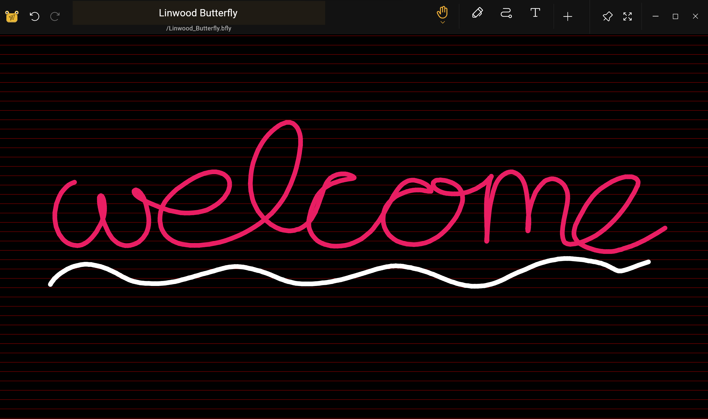

  

# Butterfly

> Notes that change the world

[![GitHub License badge](https://img.shields.io/github/license/LinwoodCloud/dev_doctor?color=EBB733&style=for-the-badge&logo=data:image/svg+xml;base64,PHN2ZyB4bWxucz0iaHR0cDovL3d3dy53My5vcmcvMjAwMC9zdmciIHdpZHRoPSIxOTIiIGhlaWdodD0iMTkyIiBmaWxsPSIjZWJiNzMzIiB2aWV3Qm94PSIwIDAgMjU2IDI1NiI%2BPHJlY3Qgd2lkdGg9IjI1NiIgaGVpZ2h0PSIyNTYiIGZpbGw9Im5vbmUiPjwvcmVjdD48cmVjdCB4PSIzMiIgeT0iNDgiIHdpZHRoPSIxOTIiIGhlaWdodD0iMTYwIiByeD0iOCIgc3Ryb2tlLXdpZHRoPSIxNiIgc3Ryb2tlPSIjZWJiNzMzIiBzdHJva2UtbGluZWNhcD0icm91bmQiIHN0cm9rZS1saW5lam9pbj0icm91bmQiIGZpbGw9Im5vbmUiPjwvcmVjdD48bGluZSB4MT0iNzYiIHkxPSI5NiIgeDI9IjE4MCIgeTI9Ijk2IiBmaWxsPSJub25lIiBzdHJva2U9IiNlYmI3MzMiIHN0cm9rZS1saW5lY2FwPSJyb3VuZCIgc3Ryb2tlLWxpbmVqb2luPSJyb3VuZCIgc3Ryb2tlLXdpZHRoPSIxNiI%2BPC9saW5lPjxsaW5lIHgxPSI3NiIgeTE9IjEyOCIgeDI9IjE4MCIgeTI9IjEyOCIgZmlsbD0ibm9uZSIgc3Ryb2tlPSIjZWJiNzMzIiBzdHJva2UtbGluZWNhcD0icm91bmQiIHN0cm9rZS1saW5lam9pbj0icm91bmQiIHN0cm9rZS13aWR0aD0iMTYiPjwvbGluZT48bGluZSB4MT0iNzYiIHkxPSIxNjAiIHgyPSIxODAiIHkyPSIxNjAiIGZpbGw9Im5vbmUiIHN0cm9rZT0iI2ViYjczMyIgc3Ryb2tlLWxpbmVjYXA9InJvdW5kIiBzdHJva2UtbGluZWpvaW49InJvdW5kIiBzdHJva2Utd2lkdGg9IjE2Ij48L2xpbmU%2BPC9zdmc%2B)](https://github.com/LinwoodCloud/butterfly/blob/main/LICENSE)

---

## Introduction

Butterfly is a note app where your ideas come first. You can paint, add texts and export them easily on every device.
This app works on android, windows, linux and in the web.

### Simple and intuitive

Every tool is on the right place. Open the app and start drawing. Change your tools by clicking on it.

### Customizable

Change everything to your needs. Choose your custom color, create a palette and add your pages to the paper.
The paper has an infinite size, perfect for your ideas and notes.

### Your data will be saved locally

Everything will be saved local on your computer. Export the notes as image or as json files which can be opened on a different device.

## Getting started

* **Try the app** [in the web](https://butterfly.linwood.dev). You have nothing to lose!
* **To download the app**, visit the [download page](https://docs.butterfly.linwood.dev/downloads).
* **If you need help**, visit the [guide](https://docs.butterfly.linwood.dev/docs) or visit [the discord server](https://discord.linwood.dev)
* **To contribute**, visit the [contribution guide](https://github.com/LinwoodCloud/butterfly/blob/develop/CONTRIBUTING.md)
* **To communicate with us**, visit [the discord server](https://discord.linwood.dev)
