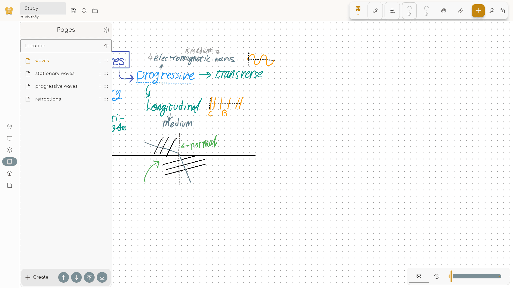
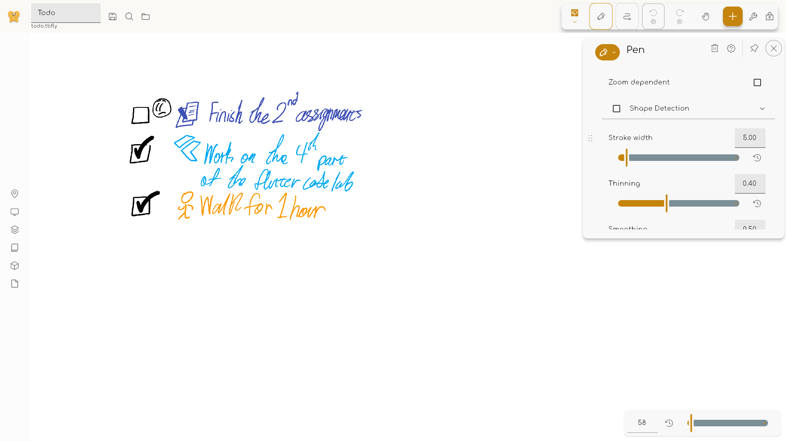
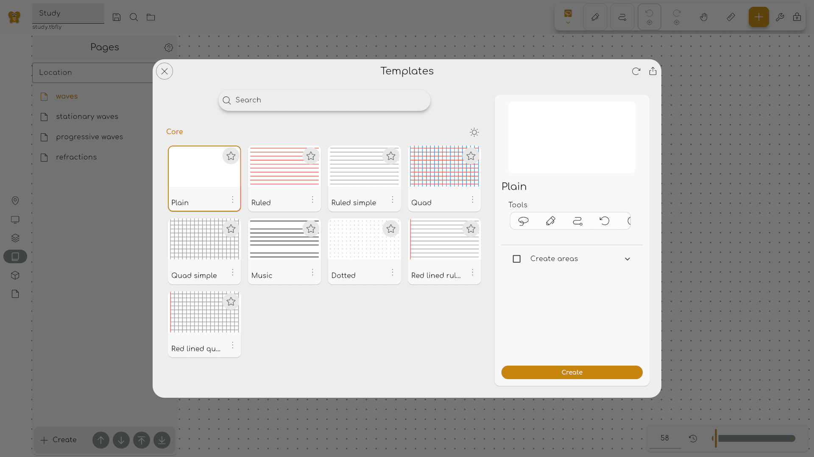

# Butterfly

> 🎨 Take notes, draw freely, and organize ideas across an endless workspace 🎨

[![GitHub License badge](https://img.shields.io/github/license/LinwoodDev/butterfly?color=EBB733&style=for-the-badge&logo=data:image/svg+xml;base64,PHN2ZyB4bWxucz0iaHR0cDovL3d3dy53My5vcmcvMjAwMC9zdmciIHdpZHRoPSIxOTIiIGhlaWdodD0iMTkyIiBmaWxsPSIjZWJiNzMzIiB2aWV3Qm94PSIwIDAgMjU2IDI1NiI%2BPHJlY3Qgd2lkdGg9IjI1NiIgaGVpZ2h0PSIyNTYiIGZpbGw9Im5vbmUiPjwvcmVjdD48cmVjdCB4PSIzMiIgeT0iNDgiIHdpZHRoPSIxOTIiIGhlaWdodD0iMTYwIiByeD0iOCIgc3Ryb2tlLXdpZHRoPSIxNiIgc3Ryb2tlPSIjZWJiNzMzIiBzdHJva2UtbGluZWNhcD0icm91bmQiIHN0cm9rZS1saW5lam9pbj0icm91bmQiIGZpbGw9Im5vbmUiPjwvcmVjdD48bGluZSB4MT0iNzYiIHkxPSI5NiIgeDI9IjE4MCIgeTI9Ijk2IiBmaWxsPSJub25lIiBzdHJva2U9IiNlYmI3MzMiIHN0cm9rZS1saW5lY2FwPSJyb3VuZCIgc3Ryb2tlLWxpbmVqb2luPSJyb3VuZCIgc3Ryb2tlLXdpZHRoPSIxNiI%2BPC9saW5lPjxsaW5lIHgxPSI3NiIgeTE9IjEyOCIgeDI9IjE4MCIgeTI9IjEyOCIgZmlsbD0ibm9uZSIgc3Ryb2tlPSIjZWJiNzMzIiBzdHJva2UtbGluZWNhcD0icm91bmQiIHN0cm9rZS1saW5lam9pbj0icm91bmQiIHN0cm9rZS13aWR0aD0iMTYiPjwvbGluZT48bGluZSB4MT0iNzYiIHkxPSIxNjAiIHgyPSIxODAiIHkyPSIxNjAiIGZpbGw9Im5vbmUiIHN0cm9rZT0iI2ViYjczMyIgc3Ryb2tlLWxpbmVjYXA9InJvdW5kIiBzdHJva2UtbGluZWpvaW49InJvdW5kIiBzdHJva2Utd2lkdGg9IjE2Ij48L2xpbmU%2BPC9zdmc%2B)](https://github.com/LinwoodDev/butterfly/blob/main/LICENSE)

    <a href="https://butterfly.linwood.dev"><b>Website</b></a> •
    <a href="https://butterfly.linwood.dev/downloads"><b>Download</b></a> •
    <a href="https://go.linwood.dev/butterfly/translate"><b>Crowdin</b></a> •
    <a href="https://go.linwood.dev/matrix"><b>Matrix</b></a> •
    <a href="https://go.linwood.dev/discord"><b>Discord</b></a> •
    <a href="https://floss.social/@linwood"><b>Mastodon</b></a> •
    <a href="https://bsky.app/profile/linwood.dev"><b>Bluesky</b></a> •
    <a href="https://linwood.dev"><b>Linwood</b></a> •
    <a href="CONTRIBUTING.md"><b>Contribute</b></a>

---

## Think visually. Keep your canvas yours.

Butterfly is an open-source app for people who think better with space around their ideas. Instead of writing everything from top to bottom on a fixed page, you get an endless workspace where you can place notes, sketches, diagrams, images, and documents wherever they make sense.

Use it for class notes, meeting notes, research, math, worksheets, planning, whiteboarding, storyboards, product sketches, or any project that starts messy and needs room to grow. Write by hand with a stylus, touch, or mouse, type text and Markdown, add shapes and lines, place images and photos, import PDFs, SVGs, and image files, then export your work as PDF, SVG, images, or portable Butterfly files.

## Features

* **✍️ Tunable drawing tools:** Shape each pen around your workflow with smoothing, thinning, pressure behavior, zoom-dependent strokes, and shape detection.
* **🧩 Mixed content:** Combine handwriting, text, Markdown, shapes, images, photos, PDFs, SVGs, rulers, grids, textures, laser pointer notes, and presentation tools.
* **🛠️ Always editable:** Move, resize, recolor, reorder, and refine most elements later instead of starting over.
* **🗂️ Project structure:** Organize large documents with multiple pages, page folders, layers, named areas, and waypoints.
* **🎨 Reusable setup:** Save templates, packs, palettes, stamps, and text styles so your favorite layouts and tools follow you.
* **🚀 Quick start:** Jump in from recent files, search, folders, imports, quick-start templates, and storage locations.
* **🔒 Local first:** Work offline, store files locally, choose a different data directory, or connect WebDAV and Nextcloud.
* **📤 Flexible export:** Share your work as PDF, SVG, images, or portable Butterfly files.
* **🤝 Experimental collaboration:** Work together with end-to-end encrypted sessions through Swamp or a self-hosted WebSocket server.

## Your work belongs to you

Your files stay under your control. Work offline, store documents on your device, choose a different data directory, or connect WebDAV and Nextcloud if you want your own sync setup. There is no required account, no required subscription, and no required proprietary cloud.

Butterfly is free, community translated, available on phones, tablets, desktops, and the web, and developed in public under the AGPL-3.0 license.

  
  

## Get Butterfly

Try Butterfly in your browser, install it on your devices, or explore the documentation:

* [Download Butterfly](https://butterfly.linwood.dev/downloads)
* [Try the web app](https://web.butterfly.linwood.dev) (Chromium-based browsers are recommended)
* [Read the documentation](https://butterfly.linwood.dev/docs/v2/intro)
* [Join the community](https://butterfly.linwood.dev/community)

---

## Contributing

We are happy to see that you are interested in contributing to Butterfly.
To get started, visit [the contributing guide](CONTRIBUTING.md).

## License

The code is open source and licensed under the [AGPL-3.0](./LICENSE) license.
All images in `app/images/` and content in `docs/` are licensed under the [CC-BY-SA-4.0](./BRANDING_LICENSE) license.
The files in `api` are licensed under the [Apache-2.0](./api/LICENSE) license instead of the AGPL-3.0 license to allow the use of the API without the need to open source the code (for example for extensions or other external services).
