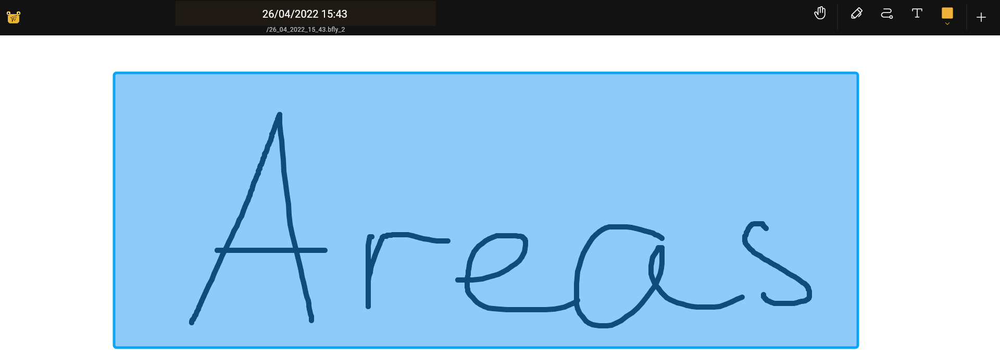

- - -
title: Bereich
- - -

## Einführung

Flächen sind eine Möglichkeit, die Größe der Leinwand zu beschränken. Sie können Flächen mit dem [-Flächenmaler](painters/area.md) erstellen. Wenn Sie auf den Hintergrund klicken, können Sie den Bereichslisten-Dialog über das Kontextmenü öffnen.

## Bereiche erstellen und löschen

Benutzen Sie den [Flächen-Maler](painters/area.md) um eine Fläche zu erstellen. Flächen können sich nicht überschneiden. Nachdem Sie einen Bereich erstellt haben, müssen Sie ihn benennen.

Klicken Sie auf den Bereich, wenn Sie ihn ändern möchten. Sie können auch den Bereichsdialog benutzen.

Sie haben ein paar Optionen in diesem Menü:

* `Bereich`betreten: Bereich eingeben. Sie können nicht außerhalb des Bereichs malen. Verlasse das Gebiet, indem du auf den Hintergrund mit dem Flächenmaler klickst.
* `Name`: Ändere den Namen des aktuellen Bereichs
* `Exportieren`: Exportiere diesen Teil der Leinwand als Bild
* `Löschen`: Diesen Bereich löschen
