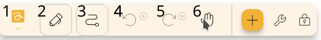

## Keyboard

Existem alguns atalhos que você pode usar no editor. Alguns deles estão escritos abaixo dos botões.

### Gerais

* `Ctrl` + `N`: Novo arquivo
* `Ctrl` + `Shift` + `N`: Novo arquivo a partir do modelo
* `Ctrl` + `E`: Exportar arquivo
* `Ctrl` + `P`: Imprimir arquivo
* `Ctrl` + `Shift` + `E`: Exportar o arquivo como imagem
* `Ctrl` + `Alt` + `E`: Exportar o arquivo como svg
* `Ctrl` + `Alt` + `Shift` + ``: Exportar arquivo como svg
* `Ctrl` + `Alt` + `P`: Abrir pacotes
* `Ctrl` + `Alt` + `S`: Abrir configurações

### Projecto

* `Ctrl` + `K`: Abrir pesquisa
* `Ctrl` + `Z`: Desfazer
* `Ctrl` + `Y`: Refazer
* `Ctrl` + `Shift` + `P`: Open waypoints dialog
* `Ctrl` + `B`: Abrir diálogo em segundo plano
* `Ctrl` + `S`: Salvar
* `Alt` + `S`: Mudar caminho
* `Ctrl` + (`1` - `0`): Mudar para ferramenta
* `Ctrl` + `+`: Zoom para
* `Ctrl` + `-`: Zoom para fora

## Caneta

Por padrão, a caneta está configurada para funcionar como o seguinte:
* `Pen`: configurado como caneta.
* `Primeiro` (botão principal, se suportado): Altere para ferramenta de mão enquanto pressionado.
* `Segundo` (botão secundário, se suportado): Altere para a segunda ferramenta (veja [configurar](#configure) seção abaixo enquanto pressionado.

## Configurar {#configure}

Você pode personalizar os controles dando a cada controle uma ferramenta índice. A indexação das ferramentas começa à esquerda da barra de ferramentas, sendo `1` o primeiro índice. Ver exemplo abaixo

Aqui, 1 se refere à ferramenta laço, 2, à ferramenta panaceia, etc.

As opções de configuração que você tem são as seguintes:

* Vazio - a ferramenta está desencurralada.
* 0 - a ferramenta irá funcionar como movimento (ou seja, mão) neste mod.
* Número positivo - A ferramenta seguirá a indexação conforme explicação acima. 

