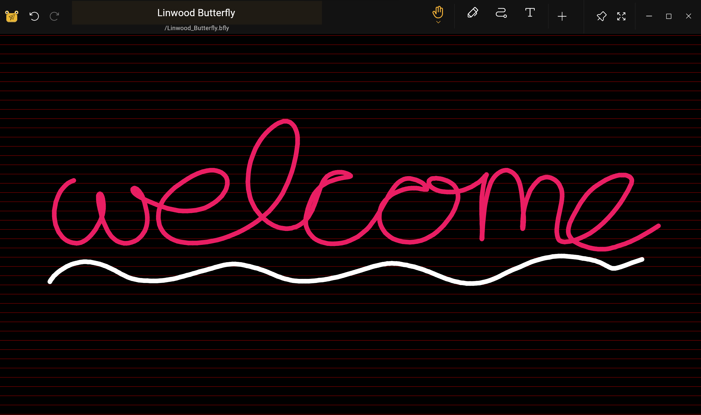

import Tabs from '@theme/Tabs';
import TabItem from '@theme/TabItem';
import { Gear, Plus, FloppyDisk, MagnifyingGlass, ScribbleLoop, Pen, Path, ArrowCounterClockwise, ArrowClockwise, Hand, Wrench, Lock} from "@phosphor-icons/react";

---

> Bine ați venit la Butterfly, aplicația opensource note.

Butterfly este o notă care ia aplicația ce vizează o experiență unificată pe toate platformele. Oferă interfață simplă cu o personalizare puternică.

## Noțiuni de bază

> Poți folosi bara laterală pentru a naviga rapid prin wiki.

Pentru a începe să lucrați la aplicație aveți două opțiuni:
1. [Descarca](/downloads) versiunea aplicatiei care este potrivit pentru platforma ta (Butterfly poate rula pe cele mai multe mobile, desktop si web platfromuri).
2. Utilizaţi [versiunea web](https://butterfly.linwood.dev) dacă nu găsiţi platforma sau dacă nu doriţi să o instalaţi pe ea. Vezi [aici](storage#web) despre stocarea fișierelor pe versiunea web.

> Odată ce deschideți aplicația, continuați citirea.

## Vizualizare principală

Opinia principală este compusă din mai multe elemente
<Tabs
    defaultValue = "desktop"
    groupId="platfrom"
        values={[
        {label:"Desktop", value:'desktop'},
 {label:"Mobile", value:'mobile'},
 ]}>
    <TabItem value="desktop">
        
        Partea de sus a ecranului ține banner-ul pentru actualizări, link-ul către aceste documente și pictograma de configurare <Gear/>. În final, în dreapta simbolului de configurare <Gear/> aveţi un meniu dropdown pentru control atunci când acest banner va apărea (întotdeauna/niciodată/pe actualizări).
        Secţiunea "File" din zona principală a stângii. Acolo, puteți face operațiunile tipice:
            - Selectați tipul de afișare (grilă sau listă)
            - Selectați [spațiul de stocare sursă](stocage) al fișierelor
            - Sortați ordinea de afișare a fișierelor
            - Adăugați un folder, fișier, șablon, sau de a importa fişiere făcând clic pe semnul <Plus/> plus
            - Tastaţi calea directă către o locaţie dorită (câmpul locaţie),
            - Caută fişiere
        În final, la dreapta, aveți afișarea unui start rapid cu șabloanele disponibile în locația curentă. Pentru o instalare nouă, aceasta include șablonul deschis și întunecat
    </TabItem>
    <TabItem value="mobile">
        La deschiderea Butterfly pe un dispozitiv mobil vi se va afișa un ecran ca acestă
        Ecranul de întâmpinare întâi](/img/welcome_screen_mobile_1. ng)   
        În partea de sus a ecranului se ține banner-ul pentru actualizări, și dedesubt poți găsi linkul de nentație și lângă el icoana de configurare <Gear/>. În final, în dreapta simbolului de configurare <Gear/> aveţi un meniu dropdown pentru control atunci când acest banner va apărea (întotdeauna/niciodată/pe actualizări).
        Sub acestea, puteţi găsi secţiunea de pornire rapidă ţinând şabloanele care vă sunt accesibile. În mod implicit, șabloanele sunt șabloanele deschise și întunecate. 
        Derulare în jos, vei vedea interfața fișierului:
        \
        ! Ecran de întâmpinare secundar](/img/welcome_screen_mobile_2. ng)  
        Secţiunea „Files” în zona principală a stângii. Acolo, puteți face operațiunile tipice:
        - Selectați tipul de afișare (grilă sau listă)
        - Selectați [spațiul de stocare sursă](stocage) al fișierelor
        - Sortați ordinea de afișare a fișierelor
        - Adăugați un folder, fișier, șablon, sau de a importa fişiere făcând clic pe semnul <Plus/> plus
        - Tastaţi calea directă către o locaţie dorită (câmpul locaţie),
        - Cauta fisiere
    </TabItem>
</Tabs>

După deschiderea unui document selectând un şablon sau un fişier existent, veţi ajunge la **Document View**

## Vizualizare document

Puteți reveni din vizualizarea documentului la lista de documente cu acțiunea din spate a dispozitivului dvs. Ca și în cazul vizualizării principale, documentul afișează modificări bazate pe dispozitivul dvs.

<Tabs
    defaultValue = "desktop"
    groupId="platfrom"
        values={[
        {label:"Desktop", value:'desktop'},
 {label:"Mobile", value:'mobile'},
 ]}>
    <TabItem value="desktop">
        În desktop vei avea în stânga sus bara de fișier
        \
        Aceasta ține, de la stânga la dreapta, 
         Butonul
        flutură pentru a deschide meniul. Lângă el este câmpul pentru nume care afișează numele notei. Puteți redenumi nota introducând un nou nume în acel câmp și salvându-l folosind butonul <FloppyDisk/> de salvare. În cele din urmă, puteţi căuta <MagnifyingGlass/> elemente în notă.
        \
        În dreapta sus a ecranului aveți bara de unelte\
        \
        Implicit această bară are instrumentul <ScribbleLoop/> lasso, unealta pentru Stiloul <Pen/> ; unealta de ștergere a traiectoriei <Path/> , butoanele de repetare <ArrowCounterClockwise/> undo și <ArrowClockwise/> , și unealta manuală <Hand/>. Apoi aveți butonul <Plus/> pentru a adăuga elemente în bara de unelte, butonul <Wrench/> pentru a configura documentul, și, în cele din urmă, instrumentul <Lock/> pentru a arăta zoom și/sau poziția ecranului. 
        ### Note importante
        1. Dacă unele elemente din bara de instrumente nu sunt vizibile pentru tine, apasă și trage (sau glisează) la stânga și la dreapta pentru a dezvălui alte unelte. 
        2. După selectarea unei unelte, va apărea un mic meniu. Dând click din nou pe unealtă vei putea să o tragi într-o poziție nouă
        3. Poți adăuga mai multe unelte în bara de instrumente făcând clic pe semnul <Plus/> plus. 
    </TabItem>
    <TabItem value="mobile">
        În vizualizarea mobilă, vei avea în partea de sus bara de fișiere
        \
        Aceasta ține, de la stânga la dreapta, 
         Butonul
        flutură pentru a deschide meniul. Lângă el este câmpul pentru nume care afișează numele notei. Puteți redenumi nota introducând un nou nume în acel câmp și salvându-l folosind butonul <FloppyDisk/> de salvare. În cele din urmă, puteţi căuta <MagnifyingGlass/> elemente în notă.
        \
        În partea de jos a ecranului aveți bara de unelte\
        \
        Implicit această bară are instrumentul <ScribbleLoop/> lasso, unealta pentru Stiloul <Pen/> ; unealta de ștergere a traiectoriei <Path/> , butoanele de repetare <ArrowCounterClockwise/> undo și <ArrowClockwise/> , și unealta manuală <Hand/>. Apoi aveți butonul <Plus/> pentru a adăuga elemente în bara de unelte, butonul <Wrench/> pentru a configura documentul, și, în cele din urmă, instrumentul <Lock/> pentru a arăta zoom și/sau poziția ecranului. 
        ### Note importante
        1. Dacă unele elemente din bara de instrumente nu sunt vizibile pentru tine, sau glisează la stânga și la dreapta pentru a dezvălui alte elemente. 
        2. Dupa selectarea unei unelte, un mic meniu va aparea sa configureze. Dând click din nou pe unealtă vei putea să o tragi într-o poziție nouă
        3. Poți adăuga mai multe unelte în bara de instrumente făcând clic pe semnul <Plus/> plus. 
    </TabItem>
</Tabs>
	

