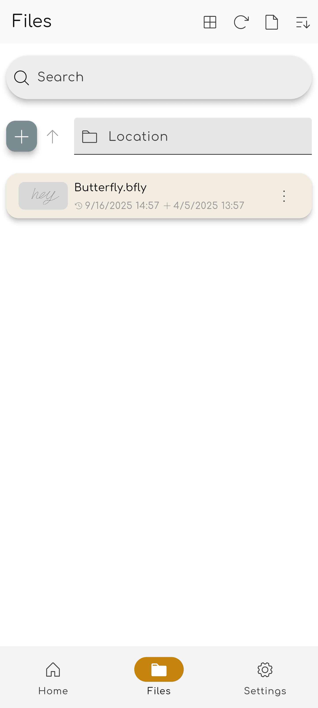

import { Gear,  Plus,  FloppyDisk,  MagnifyingGlass, ScribbleLoop, Pen, Path, ArrowCounterClockwise, ArrowClockwise, Hand, Wrench, Lock} from "@phosphor-icons/react";
import { Tabs, TabItem } from '@astrojs/starlight/components';
import logo from '/public/img/logo.svg';

---

> مرحبا بكم في باترفلي، تطبيق الملاحظات المفتوحة المصدر.

الفراشة هي تطبيق يأخذ ملاحظة يهدف إلى تجربة موحدة عبر جميع المنصات. يوفر واجهة المستخدم البسيطة مع التخصيص القوي.

## بدء التشغيل

> يمكنك استخدام الشريط الجانبي للتنقل بسرعة عبر ويكي.

لبدء العمل على التطبيق لديك خياران:

1. [Downloads](/downloads) إصدار التطبيق المناسب للمنصة الخاصة بك (يمكن للفراشة أن تعمل على معظم منصات الهاتف المحمول، وسطح المكتب، وويب).
2. استخدم [webversion](https://web.butterfly.linwood.dev) إذا لم تتمكن من العثور على المنصة الخاصة بك أو إذا كنت لا تريد تثبيتها عليها. انظر [here](storage#web) حول تخزين الملفات على إصدار الويب.

> بمجرد فتح التطبيق، استمر في القراءة.

## العرض الرئيسي

ويتألف الرأي الرئيسي من عدة عناصر

<Tabs syncKey="platform">
    <TabItem label="Desktop">
        
        الجزء العلوي من الشاشة يحمل لافتة التحديثات، الرابط إلى هذه الوثائق، وأيقونة التكوين <Gear className="inline-icon"/>. أخيراً، على يمين رمز التكوين <Gear className="inline-icon"/> لديك قائمة منسدلة للتحكم عند ظهور هذا الشعار (دائمًا/لا / على التحديثات).
        قسم "الملفات" في المنطقة الرئيسية من اليسار. هناك، يمكنك القيام بالعمليات النموذجية:
        - حدد نوع العرض (شبكة أو قائمة)
        - حدد [مصدر التخزين](.. تخزين) الملفات
        - ترتيب عرض الملفات
        - إضافة مجلد، الملف، القالب، أو استيراد الملفات عن طريق النقر فوق <Plus className="inline-icon"/> + توقيع
        - اكتب المسار المباشر إلى الموقع المطلوب (حقل الموقع)،
        - البحث عن الملفات
        وأخيراً إلى اليمين، لديك عرض البداية السريعة مع القوالب المتاحة في الموقع الحالي. للحصول على تثبيت جديد، يشمل هذا القالب الضوء والقالب المظلم
    </TabItem>
    <TabItem label="Mobile">
        عند فتح الفراشة على جهاز محمول سوف يتم تقديمه مع الشاشة كهذا
        ! مرحبا بالجزء الأول](welcome_screen_Mobile_1. ng)
        الجزء العلوي من الشاشة يحمل لافتة التحديثات، يمكنك العثور على وصلة توجيه الدكتورة وتحتها بجانب أيقونة التكوين <Gear className="inline-icon"/>. أخيراً، على يمين رمز التكوين <Gear className="inline-icon"/> لديك قائمة منسدلة للتحكم عند ظهور هذا الشعار (دائمًا/لا / على التحديثات).
        أسفلها، يمكنك العثور على قسم البداية السريعة الذي يحتوي على القوالب القابلة للطيران لك. حسب الدفاع، القوالب هي قوالب الضوء و الظلام.
        Scrolling down, you will see the file interface:
        \
          
        The "Files" section in the major area of the left. هناك، يمكنك القيام بالعمليات النموذجية:
        - حدد نوع العرض (شبكة أو قائمة)
        - حدد [مصدر التخزين](.. تخزين) الملفات
        - ترتيب عرض الملفات
        - إضافة مجلد، الملف، القالب، أو استيراد الملفات عن طريق النقر فوق <Plus className="inline-icon"/> + توقيع
        - اكتب المسار المباشر إلى الموقع المطلوب (حقل الموقع)،
        - البحث عن الملفات
 </TabItem>
</Tabs>

بمجرد فتح مستند عن طريق تحديد قالب أو ملف موجود ، ستصل إلى **عرض الوثيقة**

## عرض المستند

يمكنك العودة من عرض المستند إلى قائمة المستندات مع الإجراء الخلفي لجهازك. كما هو الحال مع العرض الرئيسي، يتغير عرض المستند استناداً إلى جهازك.

<Tabs syncKey="platform">
    <TabItem label="Desktop">
  في عرض سطح المكتب سيكون لديك في الأعلى اليسار شريط الملفات\
  . ng)\
  هذا يحفظ، من اليسار إلى اليمين، زر الفراشة  لفتح القائمة. ثم هناك حقل الاسم الذي يعرض اسم الملاحظة. يمكنك إعادة تسمية الملاحظة عن طريق كتابة اسم جديد في هذا الحقل وحفظه باستخدام زر <FloppyDisk className="inline-icon"/> لحفظ الصفحة. أخيرا يمكنك <MagnifyingGlass className="inline-icon"/> البحث عن العناصر داخل الملاحظة.
  \
  في أعلى يمين الشاشة لديك شريط الأدوات/
[toolbar](document_view_toolbar). ng)\
  بشكل افتراضي يحتوي هذا الشريط على أداة <ScribbleLoop className="inline-icon"/> lasso وأداة القلم <Pen className="inline-icon"/> A؛ أداة مسح المسار <Path className="inline-icon"/> ؛ <ArrowCounterClockwise className="inline-icon"/> التراجع و <ArrowClockwise className="inline-icon"/> يعيد البوتونات ، و <Hand className="inline-icon"/> أداة يدوية. ثم لديك زر <Plus className="inline-icon"/> لإضافة عناصر إلى شريط الأدوات، الزر <Wrench className="inline-icon"/> لتكوين المستند، وأخيراً أداة <Lock className="inline-icon"/> للنظر إلى التكبير و/أو موضع الشاشة.
  ### ملاحظات مهمة
  1. إذا كانت بعض العناصر على شريط الأدوات غير مرئية لك، انقر فوق وسحبها (أو سحبها) لليسار واليمين للكشف عن المزيد من الأدوات.
  2. بعد تحديد أداة، ستظهر قائمة صغيرة. النقر مطولا على الأداة مرة أخرى سيسمح لك بسحبها إلى موضع جديد
  3. يمكنك إضافة المزيد من الأدوات إلى شريط الأدوات بالنقر فوق علامة <Plus className="inline-icon"/> زائدا.
 </TabItem>
 <TabItem label="Mobile">
  في عرض الجوال سيكون لديك في الجزء العلوي من شريط الملفات\
     . ng)\
  هذا يحفظ، من اليسار إلى اليمين، زر الفراشة  لفتح القائمة. ثم هناك حقل الاسم الذي يعرض اسم الملاحظة. يمكنك إعادة تسمية الملاحظة عن طريق كتابة اسم جديد في هذا الحقل وحفظه باستخدام زر <FloppyDisk className="inline-icon"/> لحفظ الصفحة. أخيرا يمكنك <MagnifyingGlass className="inline-icon"/> البحث عن العناصر داخل الملاحظة.
  \
  في أسفل الشاشة لديك شريط الأدوات/
[toolbar](document_view_toolbar). ng)\
  بشكل افتراضي يحتوي هذا الشريط على أداة <ScribbleLoop className="inline-icon"/> lasso وأداة القلم <Pen className="inline-icon" /> A؛ أداة مسح المسار <Path className="inline-icon"/> ؛ <ArrowCounterClockwise className="inline-icon"/> التراجع و <ArrowClockwise className="inline-icon"/> يعيد البوتونات ، و <Hand className="inline-icon"/> أداة يدوية. ثم لديك زر <Plus className="inline-icon"/> لإضافة عناصر إلى شريط الأدوات، الزر <Wrench className="inline-icon"/> لتكوين المستند، وأخيراً أداة <Lock className="inline-icon"/> للنظر إلى التكبير و/أو موضع الشاشة.
  ### ملاحظات مهمة
  1. إذا كانت بعض العناصر على شريط الأدوات غير مرئية لك، أو اسحب لليسار واليمين للكشف عن المزيد من العناصر.
  2. بعد تحديد أداة، ستظهر قائمة صغيرة لتكوينها. النقر مطولا على الأداة مرة أخرى سيسمح لك بسحبها إلى موضع جديد
  3. يمكنك إضافة المزيد من الأدوات إلى شريط الأدوات بالنقر فوق علامة <Plus className="inline-icon"/> زائدا.
 </TabItem>
</Tabs>
