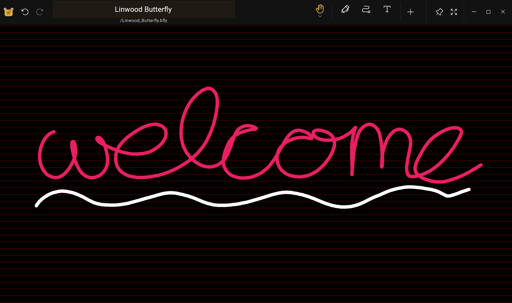

import { Gear,  Plus,  FloppyDisk,  MagnifyingGlass, ScribbleLoop, Pen, Path, ArrowCounterClockwise, ArrowClockwise, Hand, Wrench, Lock} from "@phosphor-icons/react";
import { Tabs, TabItem } from '@astrojs/starlight/components';
import logo from '/public/img/logo.svg';

---

> Velkommen til Butterfly, opensource note app.

Butterfly er en note tager app, der sigter efter samlet oplevelse på tværs af alle platforme. Det giver enkel brugerflade med kraftig tilpasning.

## Før injektion

> Du kan bruge sidebjælken til at navigere hurtigt gennem wikien.

For at begynde at arbejde på appen, har du to muligheder:

1. [Downloads](/downloads) den app-version, der passer til din platform (Butterfly kan køre på de fleste mobil-, skriveborde og webplatforme).
2. Brug [webversion](https://web.butterfly.linwood.dev) hvis du ikke kan finde din platform, eller hvis du ikke ønsker at installere den på den. Se [here](storage#web) om fillagring i webversionen.

> Når du åbner appen, fortsæt med at læse.

## Hoved visning

Hovedvisningen er sammensat af flere elementer

<Tabs syncKey="platform">
    <TabItem label="Desktop">
        
        Toppen af skærmen indeholder banneret for opdateringer, linket til denne dokumentation, og <Gear className="inline-icon"/> config ikonet. Endelig, til højre for <Gear className="inline-icon"/> config symbolet har du en rullemenu til at styre, hvornår dette banner vises (altid/aldrig/på opdateringer).
        Afsnittet "Filer" i det store område af venstre. Der, du kan gøre de typiske operationer:
        - Vælg visningstypen (gitter eller liste)
        - Vælg [kildelagringen](.. lagring) af filerne
        - Sorter visningsrækkefølgen af filerne
        - Tilføj en mappe, fil, skabelon eller import filer ved at klikke på <Plus className="inline-icon"/> plus sign
        - Skriv den direkte sti til et ønsket sted (Placeringsfeltet),
        - Søg efter filer
        Endelig til højre, du har den hurtige start display med skabeloner til rådighed i den aktuelle placering. For en frisk installation omfatter dette den lyse og mørke skabelon
    </TabItem>
    <TabItem label="Mobile">
        Når du åbner Butterfly på en mobil enhed, vil du blive præsenteret for en skærm som denne
        ! Velkomstskærm første del](welcome_screen_mobile_1. ng)
        Toppen af skærmen indeholder banneret for opdateringer, og under den kan du finde documnentation linket, og ved siden af <Gear className="inline-icon"/> config ikonet. Endelig, til højre for <Gear className="inline-icon"/> config symbolet har du en rullemenu til at styre, hvornår dette banner vises (altid/aldrig/på opdateringer).
        Nedenfor dem, kan du finde den hurtige start sektion, der holder skabeloner avialable til dig. Ved defaule er skabelonerne de lyse og mørke skabeloner.
        Ruller ned, vil du se filgrænsefladen:
        \
        ! Welcome screen second part](welcome_screen_mobile_2. ng)  
        sektionen "Filer" i det store område af venstre. Der, du kan gøre de typiske operationer:
        - Vælg visningstypen (gitter eller liste)
        - Vælg [kildelagringen](.. lagring) af filerne
        - Sorter visningsrækkefølgen af filerne
        - Tilføj en mappe, fil, skabelon eller import filer ved at klikke på <Plus className="inline-icon"/> plus sign
        - Skriv den direkte sti til et ønsket sted (Placeringsfeltet),
        - Søg efter filer
 </TabItem>
</Tabs>

Når du åbner et dokument ved at vælge en skabelon eller en eksisterende fil, vil du komme til **Document View**

## Dokumentvisningen

Du kan vende tilbage fra dokumentvisningen til dokumentlisten med baghandlingen på din enhed. Som med hovedvisningen, vises dokumentet ændringer baseret på din enhed.

<Tabs syncKey="platform">
    <TabItem label="Desktop">
  I Desktop visning, du har øverst til venstre for filbjælken\
  \
  Dette holder, fra venstre mod højre, knappen  sommerfugl for at åbne menuen. Ved siden af det er der navnet felt, der viser navnet på noten. Du kan omdøbe noten ved at skrive et nyt navn i feltet og gemme det ved hjælp af <FloppyDisk className="inline-icon"/> gem knappen. Endelig kan du <MagnifyingGlass className="inline-icon"/> søge efter elementer i noten.
  \
  Øverst til højre på skærmen har du værktøjslinjen\
   \
  Som standard har denne linje <ScribbleLoop className="inline-icon"/> lassoværktøj; <Pen className="inline-icon"/> pen-værktøjet <Path className="inline-icon"/> sti slette værktøj; <ArrowCounterClockwise className="inline-icon"/> fortryd og <ArrowClockwise className="inline-icon"/> redo butons, og <Hand className="inline-icon"/> håndværktøj. Derefter har du knappen <Plus className="inline-icon"/> for at tilføje elementer til værktøjslinjen, <Wrench className="inline-icon"/> -knappen for at konfigurere dokumentet, og endelig <Lock className="inline-icon"/> værktøj til at se zoom og/eller placeringen af skærmen.
  ### Vigtige noter
  1. Hvis noget af elementet på værktøjslinjen ikke er synligt for dig, klik og træk (eller stryge) til venstre og højre for at afsløre yderligere værktøjer.
  2. Når du har valgt et værktøj, vises en lille menu. Langt at klikke på værktøjet igen vil give dig mulighed for at trække det til en ny position
  3. Du kan tilføje flere værktøjer til værktøjslinjen ved at klikke på <Plus className="inline-icon"/> plus tegn.
 </TabItem>
 <TabItem label="Mobile">
  I mobil visning du har øverst i filbjælken\
     \
  Dette holder, fra venstre mod højre, knappen  sommerfugl for at åbne menuen. Ved siden af det er der navnet felt, der viser navnet på noten. Du kan omdøbe noten ved at skrive et nyt navn i feltet og gemme det ved hjælp af <FloppyDisk className="inline-icon"/> gem knappen. Endelig kan du <MagnifyingGlass className="inline-icon"/> søge efter elementer i noten.
  \
  I bunden af skærmen har du værktøjslinjen\
   \
  Som standard har denne linje <ScribbleLoop className="inline-icon"/> lassoværktøj; <Pen className="inline-icon" /> pen-værktøjet <Path className="inline-icon"/> sti slette værktøj; <ArrowCounterClockwise className="inline-icon"/> fortryd og <ArrowClockwise className="inline-icon"/> redo butons, og <Hand className="inline-icon"/> håndværktøj. Derefter har du knappen <Plus className="inline-icon"/> for at tilføje elementer til værktøjslinjen, <Wrench className="inline-icon"/> -knappen for at konfigurere dokumentet, og endelig <Lock className="inline-icon"/> værktøj til at se zoom og/eller placeringen af skærmen.
  ### Vigtige noter
  1. Hvis noget af elementet på værktøjslinjen ikke er synligt for dig, eller stryg til venstre og højre for at afsløre yderligere elementer.
  2. Når du har valgt et værktøj, vil en lille menu se ud til at indstille det. Langt at klikke på værktøjet igen vil give dig mulighed for at trække det til en ny position
  3. Du kan tilføje flere værktøjer til værktøjslinjen ved at klikke på <Plus className="inline-icon"/> plus tegn.
 </TabItem>
</Tabs>
