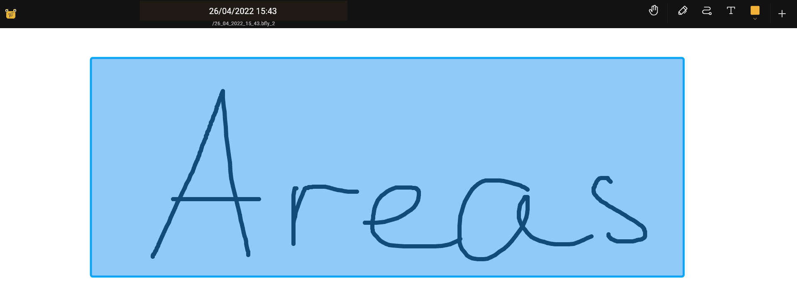

import { Tabs, TabItem } from '@astrojs/starlight/components';
import {Monitor, Plus, TextT, Faders, Folder, Stack, SignOut, SignIn, Trash, Export, PlusCircle, Door, DotsThreeVertical} from "@phosphor-icons/react";
import logo from '/public/img/logo.svg';

## Einführung

Bereiche sind eine Möglichkeit, Abschnitte der Leinwand zu erstellen. Bereiche haben viele nützliche Funktionen, zum Beispiel die Möglichkeit, nur den Inhalt eines Bereichs zu exportieren, als wäre er eine eigene Seite. Sie können einen Bereich auch „betreten“. Dadurch werden Bearbeitungswerkzeuge auf diesen Bereich beschränkt, sodass Sie sicher im Bereich arbeiten können, ohne etwas außerhalb zu beeinflussen.

## Bereiche erstellen

Wählen Sie das [<Monitor className="inline-icon"/> Bereichswerkzeug](../tools/area) aus und zeichne irgendwo auf der Leinwand ein Rechteck, um einen neuen Bereich festzulegen. Wenn sich das Bereichswerkzeug nicht in Ihrer Symbolleiste befindet, siehe [Symbolleiste anpassen](../intro#customizing-the-toolbar).

Nach dem Erstellen eines Bereichs können Sie seine Funktionen über das [Kontextmenü](#the-context-menu) aktivieren.

## Das Kontextmenü

<Tabs syncKey="platform">
    <TabItem label="Desktop">
    Sie können das Kontextmenü öffnen, indem Sie entweder mit der rechten Maustaste auf einen Bereich klicken oder links auf dem Bildschirm den Abschnitt <Monitor className="inline-icon"/> Bereich im Navigator verwenden.
    </TabItem>
    <TabItem label="Tablet">
    Sie können das Kontextmenü öffnen, indem Sie entweder lange auf einen Bereich tippen oder links auf dem Bildschirm den Abschnitt <Monitor className="inline-icon"/> Bereich im Navigator verwenden.
    </TabItem>
    <TabItem label="Mobil">
    Sie können das Kontextmenü öffnen, indem Sie entweder lange auf einen Bereich tippen oder den Abschnitt <Monitor className="inline-icon"/> Bereich im  Butterfly-Menü verwenden.
    </TabItem>
</Tabs>

Das Kontextmenü hat die folgenden Optionen:

- <TextT className="inline-icon"/> `Umbenennen` – Ändert den Namen des Bereichs.
- <SignIn className="inline-icon"/> `Bereich betreten` – Aktiviert den Bereich und beschränkt Bearbeitungen auf die Inhalte innerhalb dieses Bereichs. Nachdem Sie einen Bereich betreten haben, wählen Sie diese Option erneut, um ihn zu verlassen.
- <Trash className="inline-icon"/> `Löschen` – Löscht den Bereich. Der Inhalt innerhalb des Bereichs wird dadurch **nicht** gelöscht.
- <Faders className="inline-icon"/> `Eigenschaften` – Ändert die Abmessungen des Bereichs.
- <Folder className="inline-icon"/> `Sammlung ändern` – Ändert, zu welcher [Sammlung](../tools/collection) der Bereich gehört.
- <Stack className="inline-icon"/> `In Ebene umwandeln` – Verschiebt den Inhalt des Bereichs in eine neue [Ebene](../layers).
- <Export className="inline-icon"/> `Exportieren` – Exportiert den Inhalt des ausgewählten Bereichs.
- <PlusCircle className="inline-icon"/> `Zu Pack hinzufügen` – Fügt den Bereich einem [Pack](../pack) hinzu.

## Einen Bereich verlassen

Nachdem Sie einen Bereich betreten haben, können Sie ihn auf eine der folgenden Arten verlassen:

- Tippe auf die Schaltfläche <SignOut className="inline-icon"/> in der App-Leiste.
- Tippe im Bereich <Monitor className="inline-icon"/> „Bereich“ des Navigators auf die Schaltfläche <SignOut className="inline-icon"/>.
- Wählen Sie das <Monitor className="inline-icon"/> Bereichswerkzeug, öffnen Sie das Kontextmenü und tippen Sie dann auf <SignOut className="inline-icon"/> Bereich verlassen.

## Bereichswerkzeug konfigurieren

Sie können das Bereichswerkzeug konfigurieren, indem Sie das <Monitor className="inline-icon"/> Bereichswerkzeug in der Symbolleiste auswählen und anschließend erneut darauf klicken. Weitere Informationen finden Sie unter [Bereichswerkzeug: Konfiguration](../tools/area#configuration).
