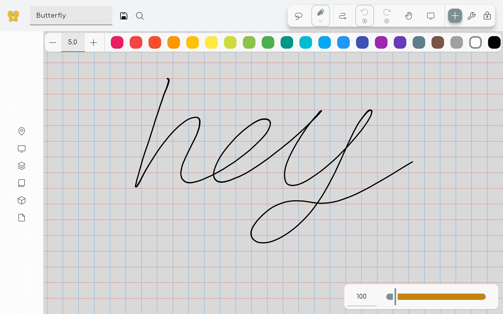
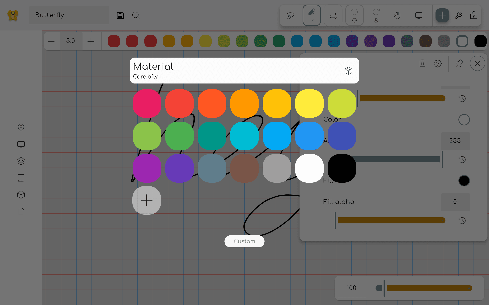
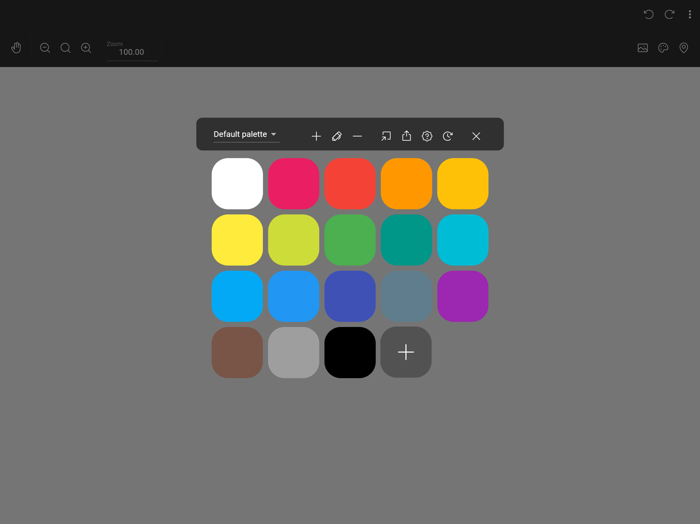

Farben können auf zwei Arten ausgewählt werden: über die Farb-Symbolleiste und über das Farbauswahl-Overlay.

Um die Farbpalette zu aktualisieren, lies die [Pack-Dokumentation](/docs/v2/pack).

## Farb-Werkzeugleiste

Wenn dies in den Einstellungen aktiviert ist, wird eine Farb-Symbolleiste angezeigt, sobald ein einfärbbares Werkzeug ausgewählt ist. Mit dieser Symbolleiste können Sie schnell eine Farbe aus einer vordefinierten Farbauswahl wählen. Klicken Sie auf das Plus-Symbol, um eine eigene Farbe auszuwählen.

## Farbe picker overlay

Dieses Overlay kann geöffnet werden, indem Sie auf eine einfärbbare Eigenschaftskachel klicken, zum Beispiel im Eigenschaftenbereich des Stiftwerkzeugs. Klicken Sie auf eine Farbe, um sie auszuwählen. Klicken Sie auf die Benutzerdefiniert-Schaltfläche, um die eigene Farbauswahl zu öffnen.

Wenn Sie eine Farbe aus der Palette löschen möchten, klicken Sie mit der rechten Maustaste darauf (oder halten Sie sie auf Touch-Geräten gedrückt) und wählen Sie Löschen.

### Custom Farbe picker

Hier können Sie jede gewünschte Farbe auswählen. Links sehen Sie ein Farbrad. Darunter können Sie die Helligkeit der Farbe auswählen.
Hinweis: Wenn Sie unten eine dunklere Farbe auswählen, wird die Auswahl im Farbrad ungenauer.

Unter dem Helligkeitsregler sehen Sie eine Vorschau der ausgewählten Farbe. Sie können auch einen Hex-Code eingeben, um eine Farbe auszuwählen. Sie wird als `#RRGGBB` angegeben, wobei `RR` der Rotwert, `GG` der Grünwert und `BB` der Blauwert in hexadezimaler Schreibweise ist.

Rechts sehen Sie die Rot-, Grün- und Blauwerte, aus denen die Farbe besteht. Diese Werte können geändert werden, indem Sie die Schieberegler ziehen oder einen Wert zwischen 0 und 255 eingeben. Hefte die Farbe an, um sie der Farbpalette hinzuzufügen.

You can use the buttons above to toggle between RGB, HSV, and HSL views.

Clicking the Eye dropper button adds the [Eye dropper tool](../tools/eye_dropper) as a [temporary tool](../tools#temporary-tools).