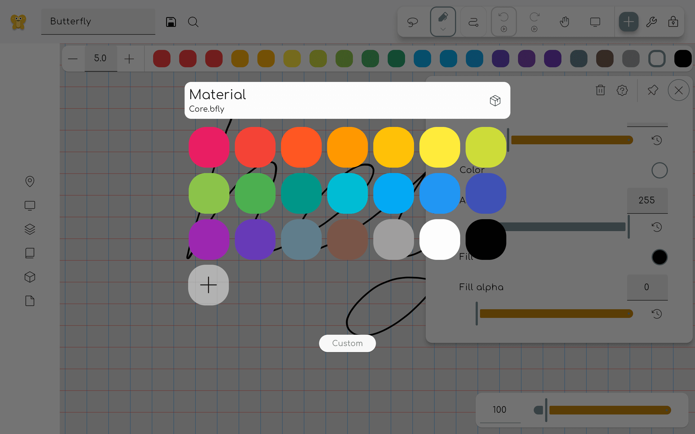
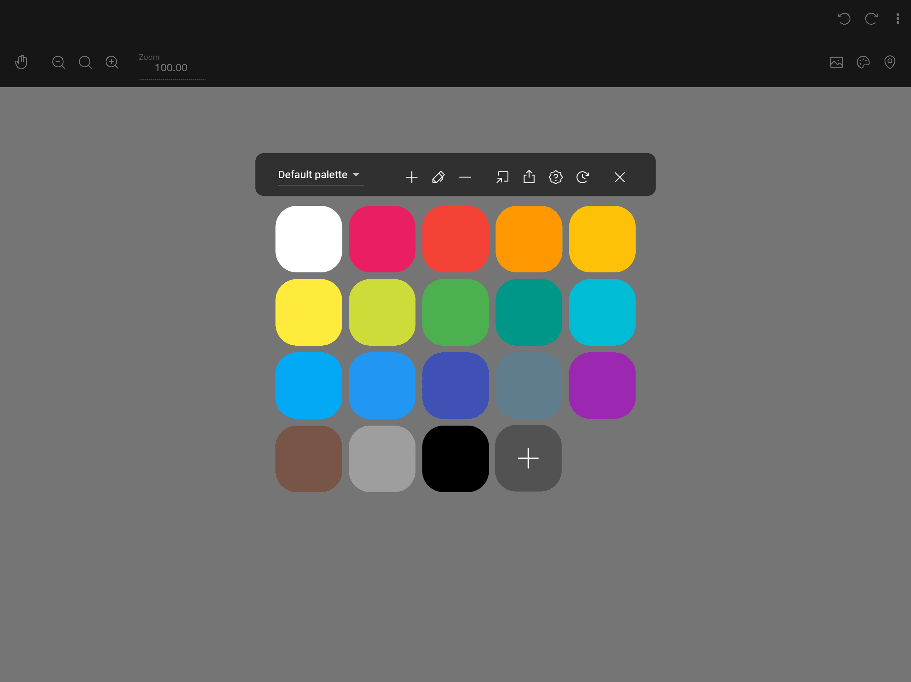

Farben können auf zwei Arten ausgewählt werden: über die Farb-Symbolleiste und über das Farbauswahl-Overlay.

Um die Farbpalette zu aktualisieren, lies die [Pack-Dokumentation](/docs/v2/pack).

The Pen, Shape, and Polygon tools also offer solid, gradient, image, and SVG paint for strokes and fills. See [Paints](../paints/) for when to use each type and how its controls work.

## Farb-Werkzeugleiste

Wenn dies in den Einstellungen aktiviert ist, wird eine Farb-Symbolleiste angezeigt, sobald ein einfärbbares Werkzeug ausgewählt ist.
Mit dieser Symbolleiste können Sie schnell eine Farbe aus einer vordefinierten Farbauswahl wählen. Click on the plus
icon to select a custom color.

## Farbe picker overlay

This overlay can be opened by clicking on a property tile that is colorable, for example inside the
properties panel of the pen tool. Klicken Sie auf eine Farbe, um sie auszuwählen. Click on the custom button to open
the custom color picker.

If you want to delete a color from the palette, right click on it (or long press on touch devices)
and select delete.

### Custom Farbe picker

Hier können Sie jede gewünschte Farbe auswählen. Links sehen Sie ein Farbrad. Under it you can
select the brightness of the color.
Hinweis: Wenn Sie unten eine dunklere Farbe auswählen, wird die Auswahl im Farbrad ungenauer.

Unter dem Helligkeitsregler sehen Sie eine Vorschau der ausgewählten Farbe. You can also enter a hex
code to select a color. It is specified as `#RRGGBB`, where `RR` is the red value, `GG` is the green
value, and `BB` is the blue value in hexadecimal notation.

Rechts sehen Sie die Rot-, Grün- und Blauwerte, aus denen die Farbe besteht. These values can be
changed by dragging the sliders or by entering a value between 0 and 255. Pin the color to add it to
the color palette.

You can use the buttons above to toggle between RGB, HSV, and HSL views.

Clicking the Eye dropper button adds the [Eye dropper tool](../tools/eye_dropper) as
a [temporary tool](../tools#temporary-tools).
