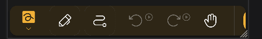

import {
  Gear,
  Plus,
  FloppyDisk,
  MagnifyingGlass,
  ScribbleLoop,
  Pen,
  Path,
  ArrowCounterClockwise,
  ArrowClockwise,
  Hand,
  Wrench,
  Lock,
  Folder,
  GridFour,
  List,
} from "@phosphor-icons/react";
import { Tabs, TabItem } from "@astrojs/starlight/components";
import logo from "/public/img/logo.svg";

---

> Willkommen bei Butterfly, der Opensource Notiz-App.

Butterfly ist eine Notizen-App, die auf eine einheitliche Erfahrung auf allen Plattformen abzielt. Es bietet eine einfache Benutzeroberfläche mit leistungsstarken Anpassungen.

## Erste Schritte

> Sie können die Seitenleiste benutzen, um schnell durch dieses Wiki zu navigieren.

Um mit der Arbeit an der App zu beginnen, haben Sie zwei Optionen:

1. [Download](/downloads) die App-Version, die für Ihre Plattform geeignet ist. Butterfly kann auf den meisten Mobil-, Desktop- und Web-Plattformen laufen.
2. Verwenden Sie die [Web-Version](https://web.butterfly.linwood.dev), wenn Sie Ihre Plattform nicht finden oder die App nicht installieren möchten. Siehe [here](storage#web) für Informationen über die Speicherung von Dateien auf der Web-Version.

> Sobald Sie die App geöffnet haben, lesen Sie weiter.

## Die Home-Ansicht

<Tabs syncKey="Plattform">
  <TabItem label="Desktop">
    
    Am oberen Bildschirmrand befindet sich der Update-Banner, ein Link zu dieser Dokumentation und die <Gear className="inline-icon" /> Einstellungen-Schaltfläche. Zum Schluss auf der rechten Seite der <Gear className="inline-icon" /> Einstellungen-Schaltfläche haben Sie ein Dropdown-Menü um zu kontrollieren, wann der Update-Banner angezeigt wird (immer/nie/bei Updates).

    Der Abschnitt Dateien ist der Hauptbereich links. Hier können Sie folgende Operationen durchführen:

    * Wählen Sie den Anzeigetyp (<GridFour className="inline-icon" /> Raster oder <List className="inline-icon" /> Liste)
    * Wählen Sie den [Quellspeicher](../storage) der Dateien
    * Reihenfolge der Dateien sortieren
    * Füge einen Ordner, Datei, Vorlage oder importiere Dateien hinzu, indem du auf das <Plus className="inline-icon" /> Plus-Zeichen klickst
    * Wechseln Sie zu einem anderen Verzeichnis, indem Sie das Feld <Folder className="inline-icon" /> ein Ort eingeben
    * Suche nach Dateien

    Schließlich, auf der rechten Seite, haben Sie die Schnellstart-Anzeige mit den Vorlagen an der aktuellen Stelle. Für eine neue Installation beinhaltet dies die Vorlagen Hell und Dunkel.
  </TabItem>

  <TabItem label="Mobil">
    Beim Öffnen von Butterfly auf einem mobilen Gerät wird dir ein Bildschirm wie folgt präsentiert:
    ! Begrüßungsbildschirm](welcome_screen_mobile_1.png)
    Am oberen Bildschirmrand befindet sich das Update-Banner. Darunter finden Sie einen Link zu dieser Dokumentation, die <Gear className="inline-icon" /> Einstellungen-Schaltfläche, und ein Drop-Down-Menü, um zu steuern, wann der Update-Banner erscheint (immer/nie/bei Updates).

    Unter diesen finden Sie die Schnellstart-Sektion mit den Vorlagen, die an der aktuellen Stelle verfügbar sind. Für eine neue Installation beinhaltet dies die Vorlagen Hell und Dunkel.

    Scrollen Sie nach unten, sehen Sie den Abschnitt Dateien:
    \
    
    Hier können Sie folgende Operationen durchführen:

    * Wählen Sie den Anzeigetyp (<GridFour className="inline-icon" /> Raster oder <List className="inline-icon" /> Liste)
    * Wählen Sie den [Quellspeicher](../storage) der Dateien
    * Reihenfolge der Dateien sortieren
    * Füge einen Ordner, Datei, Vorlage oder importiere Dateien hinzu, indem du auf das <Plus className="inline-icon" /> Plus-Zeichen klickst
    * Wechseln Sie zu einem anderen Verzeichnis, indem Sie das Feld <Folder className="inline-icon" /> ein Ort eingeben
    * Suche nach Dateien
  </TabItem>
</Tabs>

Sobald Sie ein Dokument durch Auswahl einer Vorlage oder einer existierenden Datei geöffnet haben, gelangen Sie zur **Dokumentenansicht**.

## Die Dokumentenansicht

Sie können von der Dokumentenansicht mit der Zurück-Taste Ihres Geräts in die Dokumentenliste zurückkehren. As with the home view, the document display changes based on your device.

<Tabs syncKey="Plattform">
  <TabItem label="Desktop">
    In the top-left of the screen, you have the file bar:\
    

    This holds, from left to right:

    * The  Butterfly button, which opens the menu.
    * The Name field, which displays the name of the note. You can rename the note by typing a new name into the field and saving the note.
    * The <FloppyDisk className="inline-icon" /> Save button. You can enable auto-saving and optionally disable this button by going to Settings → Behaviors → Autosave.
    * The <MagnifyingGlass className="inline-icon" /> Search button, which allow you to search for elements within the note.
  </TabItem>

  <TabItem label="Mobil">
    At the top of the screen, you have the file bar:\
    

    This holds, from left to right:

    * The  Butterfly button, which opens the menu.
    * The Name field, which displays the name of the note. You can rename the note by typing a new name into the field and saving the note.
    * The <FloppyDisk className="inline-icon" /> Save button. You can enable auto-saving and optionally disable this button by going to Settings → Behaviors → Autosave.
    * The <MagnifyingGlass className="inline-icon" /> Search button, which allow you to search for elements within the note.
  </TabItem>
</Tabs>

### Die Werkzeugleiste

<Tabs syncKey="Plattform">
  <TabItem label="Desktop">
    In the top-right of the screen, you have the toolbar:\
    

    Standardmäßig enthält diese Leiste:

    * The [<ScribbleLoop className="inline-icon" /> Lasso Select tool](tools/select)
    * The [<Pen className="inline-icon" /> Pen tool](tools/pen)
    * The [<Path className="inline-icon" /> Path Erase tool](tools/path_eraser)
    * The [<ArrowCounterClockwise className="inline-icon" /> Undo](tools/undo) and [<ArrowClockwise className="inline-icon" /> Redo](tools/redo) buttons
    * The [<Hand className="inline-icon" /> Hand tool](tools/hand).

    Then you have the <Plus className="inline-icon" /> button to add elements to the tool bar, the <Wrench className="inline-icon" /> button to configure the document, and finally the <Lock className="inline-icon" /> tool to lock the zoom and/or the position of the screen. If some of the elements on the toolbar are not visible to you, click and drag (or swipe) left or right to reveal further tools.
  </TabItem>

  <TabItem label="Mobil">
    At the bottom of the screen, you have the toolbar:\
    

    Standardmäßig enthält diese Leiste:

    * The [<ScribbleLoop className="inline-icon" /> Lasso Select tool](tools/select)
    * The [<Pen className="inline-icon" /> Pen tool](tools/pen)
    * The [<Path className="inline-icon" /> Path Erase tool](tools/path_eraser)
    * The [<ArrowCounterClockwise className="inline-icon" /> Undo](tools/undo) and [<ArrowClockwise className="inline-icon" /> Redo](tools/redo) buttons
    * The [<Hand className="inline-icon" /> Hand tool](tools/hand).

    Then you have the <Plus className="inline-icon" /> button to add elements to the tool bar, the <Wrench className="inline-icon" /> button to configure the document, and finally the <Lock className="inline-icon" /> tool to look the zoom and/or the position of the screen. If some of the elements on the toolbar are not visible to you, swipe left or right to reveal further tools.
  </TabItem>
</Tabs>

#### Customizing the Toolbar

<Tabs syncKey="Plattform">
  <TabItem label="Desktop">
    To add more tools to the toolbar, click the <Plus className="inline-icon" /> Add button. In the Add menu, you can use the search bar or filters to find the tool you are looking for. For more information, see [Add](add).

    To reorder the tools on your toolbar, first select a tool and then click-and-drag it to a new position. Some input methods have shortcuts to quickly switch to tools based on their position on the toolbar, which can be [configured](shortcuts#configure).

    Many tools have a configuration menu, which allows you to change settings about how the tool behaves. To open this menu, first select a tool in the toolbar and then click it again.
  </TabItem>

  <TabItem label="Mobil">
    To add more tools to the toolbar, tap the <Plus className="inline-icon" /> Add button. In the Add menu, you can use the search bar or filters to find the tool you are looking for. For more information, see [Add](add).

    To reorder the tools on your toolbar, first select a tool and then long-tap and drag it to a new position. Some input methods have shortcuts to quickly switch to tools based on their position on the toolbar, which can be [configured](shortcuts#configure).

    Many tools have a configuration menu, which allows you to change settings about how the tool behaves. To open this menu, first select a tool in the toolbar and then tap it again.
  </TabItem>
</Tabs>
