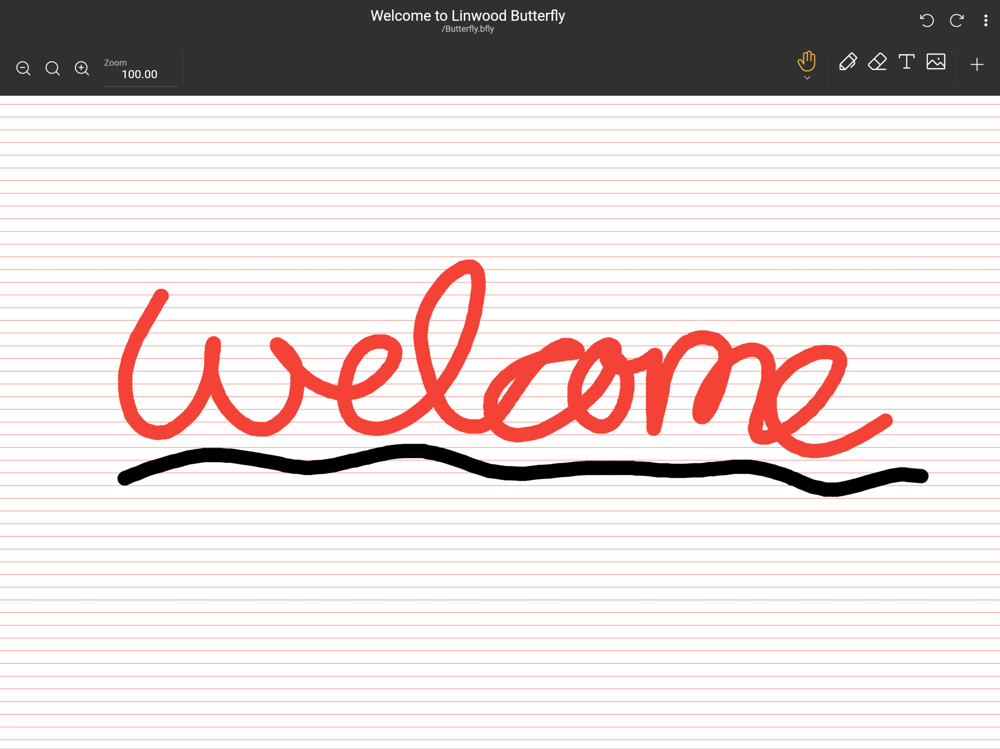

import { Gear,  Plus,  FloppyDisk,  MagnifyingGlass, ScribbleLoop, Pen, Path, ArrowCounterClockwise, ArrowClockwise, Hand, Wrench, Lock} from "@phosphor-icons/react";
import { Tabs, TabItem } from '@astrojs/starlight/components';
import logo from '/public/img/logo.svg';

---

> Willkommen bei Butterfly, der Opensource Notiz-App.

Butterfly ist eine Notizenanwendung, die auf einheitliche Erfahrungen auf allen Plattformen abzielt. Es bietet einfache Benutzeroberfläche mit leistungsstarken Anpassungen.

## Erste Schritte

> Sie können die Seitenleiste benutzen, um schnell durch das Wiki zu navigieren.

Um mit der Arbeit an der App zu beginnen, haben Sie zwei Möglichkeiten:

1. [Downloads](/downloads) die App-Version, die für Ihre Plattform geeignet ist (Butterfly kann auf den meisten Mobil-, Desktop- und Web-Plattformen laufen).
2. Benutze [Web Version](https://web.butterfly.linwood.dev), wenn du deine Plattform nicht finden kannst oder sie nicht auf ihr installieren möchtest. Siehe [here](Storage#web) über Dateispeicher auf der Web-Version.

> Sobald Sie die App geöffnet haben, lesen Sie weiter.

## Hauptansicht

Die Hauptansicht besteht aus mehreren Elementen

<Tabs syncKey="platform">
    <TabItem label="Desktop">
        
        Der obere Rand des Bildschirms enthält den Banner für Updates, den Link zu diesen Dokumentationen, und das <Gear className="inline-icon"/> Konfigurations-Symbol. Auf der rechten Seite des <Gear className="inline-icon"/> Konfig-Symbols haben Sie schließlich ein Dropdown-Menü, mit dem Sie kontrollieren können, wann dieser Banner angezeigt wird (immer/nein/bei Updates).
        Der Abschnitt "Dateien" im Hauptbereich der linken Seite. Dort, du kannst die typischen Operationen durchführen:
        - Wähle den Anzeigetyp (Gitter oder Liste)
        - Wähle den [Quell-Speicher](.. speicher) der Dateien
        - Sortieren Sie die Anzeigereihenfolge der Dateien
        - Ordner hinzufügen, Datei, Vorlage, oder importieren Sie Dateien durch Klicken auf <Plus className="inline-icon"/> plus Zeichen
        - Geben Sie den direkten Pfad zu einem gewünschten Ort ein (Ortsfeld),
        - Suche nach Dateien
        Schließlich rechts Sie haben die Schnellstartanzeige mit den Vorlagen, die an der aktuellen Stelle verfügbar sind. Für eine Neuinstallation beinhaltet dies die helle und dunkle Vorlage
    </TabItem>
    <TabItem label="Mobile">
        Beim Öffnen von Butterfly auf einem mobilen Gerät wird Ihnen ein Bildschirm wie dieser
        vorgestellt! Startbildschirm erster Teil](welcome_screen_mobile_1. ng)
        Der obere Rand des Bildschirms enthält den Banner für Updates, und darunter finden Sie den Link zur Dokumentation und daneben das <Gear className="inline-icon"/> Konfigurations-Symbol. Auf der rechten Seite des <Gear className="inline-icon"/> Konfig-Symbols haben Sie schließlich ein Dropdown-Menü, mit dem Sie kontrollieren können, wann dieser Banner angezeigt wird (immer/nein/bei Updates).
        Unter diesen finden Sie den Schnellstart-Abschnitt mit den Vorlagen, die für Sie zugänglich sind. Mit defaule sind die Vorlagen die hellen und dunklen Vorlagen.
        Herunterscrollen Sie werden die Dateischnittstelle sehen:
        \
        ! Begrüßungsbildschirm zweiter Teil](welcome_screen_mobile_2. ng)  
        Der Abschnitt "Dateien" im Hauptbereich der linken Seite. Dort, du kannst die typischen Operationen durchführen:
        - Wähle den Anzeigetyp (Gitter oder Liste)
        - Wähle den [Quell-Speicher](.. speicher) der Dateien
        - Sortieren Sie die Anzeigereihenfolge der Dateien
        - Ordner hinzufügen, Datei, Vorlage, oder importieren Sie Dateien durch Klicken auf <Plus className="inline-icon"/> plus Zeichen
        - Geben Sie den direkten Pfad zu einem gewünschten Ort ein (Ortsfeld),
        - Suche nach Dateien
 </TabItem>
</Tabs>

Sobald Sie ein Dokument durch Auswahl einer Vorlage oder einer existierenden Datei geöffnet haben, gelangen Sie zur **Dokumentenansicht**

## Die Dokumentansicht

Sie können von der Dokumentenansicht mit der Rücken-Aktion Ihres Geräts in die Dokumentenliste zurückkehren. Wie bei der Hauptansicht zeigt das Dokument Änderungen basierend auf Ihrem Gerät an.

<Tabs syncKey="platform">
    <TabItem label="Desktop">
  In der Desktop-Ansicht Sie haben oben links die Dateileiste\
  \
  Dies hält von links nach rechts die  Schmetterlings-Taste zum Öffnen des Menüs. Daneben befindet sich das Namensfeld, das den Namen der Notiz anzeigt. Sie können die Notiz umbenennen, indem Sie einen neuen Namen in dieses Feld eingeben und mit dem <FloppyDisk className="inline-icon"/> Speichern-Button speichern. Schließlich kannst du <MagnifyingGlass className="inline-icon"/> nach Elementen innerhalb der Notiz suchen.
  \
  At the top right of the screen you have the toolbar\
  \
  By default this bar has the <ScribbleLoop className="inline-icon"/> lasso tool; the <Pen className="inline-icon"/> pen tool; the <Path className="inline-icon"/> path erase tool; the <ArrowCounterClockwise className="inline-icon"/> undo and <ArrowClockwise className="inline-icon"/> redo butons, and the <Hand className="inline-icon"/> hand tool. Dann haben Sie die <Plus className="inline-icon"/> -Taste, um Elemente zur Werkzeugleiste hinzuzufügen, die <Wrench className="inline-icon"/> Schaltfläche zum Konfigurieren des Dokuments und schließlich das <Lock className="inline-icon"/> Werkzeug, um den Zoom und/oder die Position des Bildschirms zu sehen.
  ### Wichtige Hinweise
  1. Wenn einige der Elemente in der Werkzeugleiste nicht für Sie sichtbar sind, klicken Sie und ziehen (oder wischen) nach links und rechts, um weitere Werkzeuge anzuzeigen.
  2. Nach der Auswahl eines Werkzeugs erscheint ein kleines Menü. Durch langes Klicken auf das Werkzeug können Sie es an eine neue Position
  3 ziehen. Sie können weitere Werkzeuge zur Werkzeugleiste hinzufügen, indem Sie auf das <Plus className="inline-icon"/> Plus-Zeichen klicken.
 </TabItem>
 <TabItem label="Mobile">
  In der Handy-Ansicht Sie haben oben die Dateileiste\
     \
  Dies hält von links nach rechts die  Schmetterlings-Taste zum Öffnen des Menüs. Daneben befindet sich das Namensfeld, das den Namen der Notiz anzeigt. Sie können die Notiz umbenennen, indem Sie einen neuen Namen in dieses Feld eingeben und mit dem <FloppyDisk className="inline-icon"/> Speichern-Button speichern. Schließlich kannst du <MagnifyingGlass className="inline-icon"/> nach Elementen innerhalb der Notiz suchen.
  \
  At the bottom of the screen you have the toolbar\
  \
  By default this bar has the <ScribbleLoop className="inline-icon"/> lasso tool; the <Pen className="inline-icon" /> pen tool; the <Path className="inline-icon"/> path erase tool; the <ArrowCounterClockwise className="inline-icon"/> undo and <ArrowClockwise className="inline-icon"/> redo butons, and the <Hand className="inline-icon"/> hand tool. Dann haben Sie die <Plus className="inline-icon"/> -Taste, um Elemente zur Werkzeugleiste hinzuzufügen, die <Wrench className="inline-icon"/> Schaltfläche zum Konfigurieren des Dokuments und schließlich das <Lock className="inline-icon"/> Werkzeug, um den Zoom und/oder die Position des Bildschirms zu sehen.
  ### Wichtige Hinweise
  1. Wenn einige der Elemente in der Werkzeugleiste nicht für Sie sichtbar sind, oder wischen Sie links und rechts, um weitere Elemente anzuzeigen.
  2. Nach der Auswahl eines Werkzeugs erscheint ein kleines Menü, um es zu konfigurieren. Durch langes Klicken auf das Werkzeug können Sie es an eine neue Position
  3 ziehen. Sie können weitere Werkzeuge zur Werkzeugleiste hinzufügen, indem Sie auf das <Plus className="inline-icon"/> Plus-Zeichen klicken.
 </TabItem>
</Tabs>
