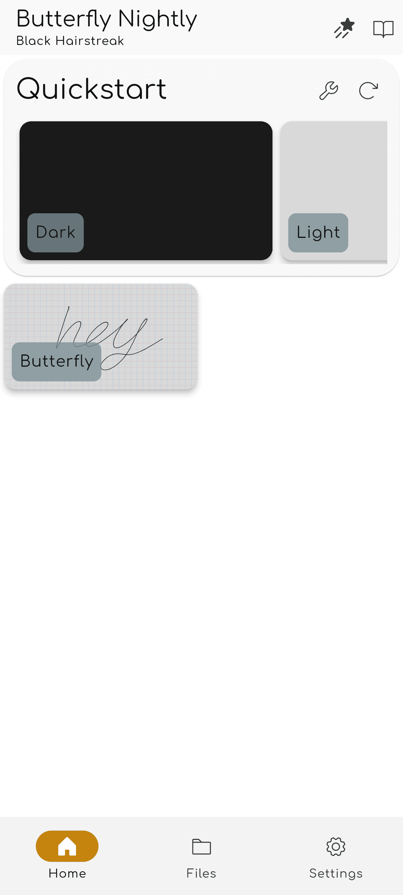
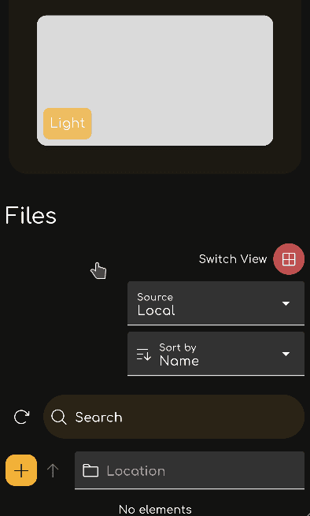
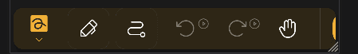

import {
  Gear,
  Plus,
  FloppyDisk,
  MagnifyingGlass,
  ScribbleLoop,
  Pen,
  Path,
  ArrowCounterClockwise,
  ArrowClockwise,
  Hand,
  Wrench,
  Lock,
  Folder,
  GridFour,
  List,
} from "@phosphor-icons/react";
import { Tabs, TabItem } from "@astrojs/starlight/components";
import logo from "/public/img/logo.svg";

---

> Willkommen bei Butterfly, der Opensource Notiz-App.

Butterfly ist eine Notizen-App, die auf eine einheitliche Erfahrung auf allen Plattformen abzielt. Es bietet eine einfache Benutzeroberfläche mit leistungsstarken Anpassungen.

## Erste Schritte

> Sie können die Seitenleiste benutzen, um schnell durch dieses Wiki zu navigieren.

Um mit der Arbeit an der App zu beginnen, haben Sie zwei Optionen:

1. [Download](/downloads) die App-Version, die für Ihre Plattform geeignet ist. Butterfly kann auf den meisten Mobil-, Desktop- und Web-Plattformen laufen.
2. Verwenden Sie die [Web-Version](https://web.butterfly.linwood.dev), wenn Sie Ihre Plattform nicht finden oder die App nicht installieren möchten. Siehe [hier](../storage#web) für Informationen zur Dateispeicherung in der Web-Version.

> Sobald Sie die App geöffnet haben, lesen Sie weiter.

## Die Home-Ansicht

<Tabs syncKey="Plattform">
  <TabItem label="Desktop">

    
    Oben auf dem Bildschirm befinden sich das Update-Banner, ein Link zu dieser Dokumentation und die Schaltfläche <Gear className="inline-icon" /> Einstellungen. Zum Schluss auf der rechten Seite der <Gear className="inline-icon" /> Einstellungen-Schaltfläche haben Sie ein Dropdown-Menü um zu kontrollieren, wann der Update-Banner angezeigt wird (immer/nie/bei Updates).

    Der Abschnitt Dateien ist der Hauptbereich links. Hier können Sie folgende Operationen durchführen:
    * Wählen Sie den Anzeigetyp (<GridFour className="inline-icon" /> Raster oder <List className="inline-icon" /> Liste)
    * Wählen Sie den [Quellspeicher](../storage) der Dateien
    * Reihenfolge der Dateien sortieren
    * Fügen Sie einen Ordner, eine Datei oder eine Vorlage hinzu oder importieren Sie Dateien, indem Sie auf das <Plus className="inline-icon" /> Plus-Zeichen klicken
    * Wechseln Sie zu einem anderen Verzeichnis, indem Sie das Feld <Folder className="inline-icon" /> ein Ort eingeben
    * Suche nach Dateien

    Schließlich, auf der rechten Seite, haben Sie die Schnellstart-Anzeige mit den Vorlagen an der aktuellen Stelle. Für eine neue Installation beinhaltet dies die Vorlagen Hell und Dunkel.

  </TabItem>
  <TabItem label="Mobil">

    Wenn Sie Butterfly auf einem Mobilgerät öffnest, wird Ihnen ein Bildschirm wie dieser angezeigt:
    
    Oben auf dem Bildschirm sehen Sie den Release-Namen sowie einen Link zu den Versionshinweisen und zur Dokumentation.

    Unter diesen finden Sie die Schnellstart-Sektion mit den Vorlagen, die an der aktuellen Stellen Sie verfügbar sind. Für eine neue Installation beinhaltet dies die Vorlagen Hell und Dunkel. Unter den Vorlagen sehen Sie Ihre zuletzt verwendeten Dateien.

    Wenn Sie unten auf den Dateien-Tab klicken, gelangen Sie zur Dateiliste:
    \
    
    Hier können Sie folgende Aktionen ausführen:
    * Wählen Sie den Anzeigetyp (<GridFour className="inline-icon" /> Raster oder <List className="inline-icon" /> Liste)
    * Dateiliste neu laden
    * Wählen Sie den [Quellspeicher](../storage) der Dateien
    * Reihenfolge der Dateien sortieren
    * Fügen Sie einen Ordner, eine Datei oder eine Vorlage hinzu oder importieren Sie Dateien, indem Sie auf das <Plus className="inline-icon" /> Plus-Zeichen klicken
    * Wechseln Sie zu einem anderen Verzeichnis, indem Sie das Feld <Folder className="inline-icon" /> ein Ort eingeben
    * Suche nach Dateien

  </TabItem>
</Tabs>

Sobald Sie ein Dokument durch Auswahl einer Vorlage oder einer existierenden Datei geöffnet haben, gelangen Sie zur **Dokumentenansicht**.

## Die Dokumentenansicht

Sie können von der Dokumentenansicht mit der Zurück-Taste Ihres Geräts in die Dokumentenliste zurückkehren. Wie bei der Startansicht ändert sich die Dokumentansicht je nach Gerät.

<Tabs syncKey="Plattform">
  <TabItem label="Desktop">

    Oben links auf dem Bildschirm befindet sich die Dateileiste:\
    

    Dies enthält von links nach rechts:

    * Die  Butterfly-Schaltfläche, die das Menü öffnet.
    * Das Namensfeld, das den Namen der Notiz anzeigt. Sie können die Notiz umbenennen, indem Sie einen neuen Namen in das Feld eingeben und die Notiz speichern.
    * Die Schaltfläche <FloppyDisk className="inline-icon" /> Speichern. Sie können automatisches Speichern aktivieren und diese Schaltfläche optional deaktivieren, indem Sie zu Einstellungen → Verhalten → Automatisches Speichern gehst.
    * Die Schaltfläche <MagnifyingGlass className="inline-icon" /> Suchen, mit der Sie nach Elementen innerhalb der Notiz suchen können.

  </TabItem>
  <TabItem label="Mobil">

    Oben auf dem Bildschirm befindet sich die Dateileiste:\
    

    Dies enthält von links nach rechts:

    * Die  Butterfly-Schaltfläche, die das Menü öffnet.
    * Das Namensfeld, das den Namen der Notiz anzeigt. Sie können die Notiz umbenennen, indem Sie einen neuen Namen in das Feld eingeben und die Notiz speichern.
    * Die Schaltfläche <FloppyDisk className="inline-icon" /> Speichern. Sie können automatisches Speichern aktivieren und diese Schaltfläche optional deaktivieren, indem Sie zu Einstellungen → Verhalten → Automatisches Speichern gehst.
    * Die Schaltfläche <MagnifyingGlass className="inline-icon" /> Suchen, mit der Sie nach Elementen innerhalb der Notiz suchen können.

  </TabItem>
</Tabs>

### Die Werkzeugleiste

<Tabs syncKey="Plattform">
  <TabItem label="Desktop">

    Oben rechts auf dem Bildschirm befindet sich die Symbolleiste:\
    

    Standardmäßig enthält diese Leiste:

    * Das [<ScribbleLoop className="inline-icon" /> Lasso-Auswahlwerkzeug](../tools/select)
    * Das [<Pen className="inline-icon" /> Stiftwerkzeug](../tools/pen)
    * Das [<Path className="inline-icon" /> Pfadradierer-Werkzeug](../tools/path_eraser)
    * Die Schaltflächen [<ArrowCounterClockwise className="inline-icon" /> Rückgängig](../tools/undo) und [<ArrowClockwise className="inline-icon" /> Wiederholen](../tools/redo)
    * Das [<Hand className="inline-icon" /> Handwerkzeug](../tools/hand).

    Danach gibt es die Schaltfläche <Plus className="inline-icon" /> zum Hinzufügen von Elementen zur Symbolleiste, die Schaltfläche <Wrench className="inline-icon" /> zum Konfigurieren des Dokuments und schließlich das Werkzeug <Lock className="inline-icon" /> zum Sperren des Zooms und/oder der Bildschirmposition. Wenn einige Elemente der Symbolleiste nicht sichtbar sind, klicken und ziehen Sie oder wischen Sie nach links oder rechts, um weitere Werkzeuge anzuzeigen.

  </TabItem>
  <TabItem label="Mobil">

    Unten auf dem Bildschirm befindet sich die Symbolleiste:\
    

    Standardmäßig enthält diese Leiste:

    * Das [<ScribbleLoop className="inline-icon" /> Lasso-Auswahlwerkzeug](../tools/select)
    * Das [<Pen className="inline-icon" /> Stiftwerkzeug](../tools/pen)
    * Das [<Path className="inline-icon" /> Pfadradierer-Werkzeug](../tools/path_eraser)
    * Die Schaltflächen [<ArrowCounterClockwise className="inline-icon" /> Rückgängig](../tools/undo) und [<ArrowClockwise className="inline-icon" /> Wiederholen](../tools/redo)
    * Das [<Hand className="inline-icon" /> Handwerkzeug](../tools/hand).

    Danach gibt es die Schaltfläche <Plus className="inline-icon" /> zum Hinzufügen von Elementen zur Symbolleiste, die Schaltfläche <Wrench className="inline-icon" /> zum Konfigurieren des Dokuments und schließlich das Werkzeug <Lock className="inline-icon" /> zum Sperren des Zooms und/oder der Bildschirmposition. Wenn einige Elemente der Symbolleiste nicht sichtbar sind, wische nach links oder rechts, um weitere Werkzeuge anzuzeigen.

  </TabItem>
</Tabs>

#### Symbolleiste anpassen

<Tabs syncKey="Plattform">
  <TabItem label="Desktop">

    Um weitere Werkzeuge zur Symbolleiste hinzuzufügen, klicken Sie auf die Schaltfläche <Plus className="inline-icon" /> Hinzufügen. Im Menü „Hinzufügen“ können Sie die Suchleiste oder Filter verwenden, um das gewünschte Werkzeug zu finden. Weitere Informationen, see [Hinzufügen](../add).

    Um die Werkzeuge in Ihrer Symbolleiste neu anzuordnen, wählen Sie zuerst ein Werkzeug aus und ziehen Sie es dann an eine neue Position. Einige Eingabemethoden haben Tastenkürzel, um anhand der Position in der Symbolleiste schnell zu Werkzeugen zu wechseln; dies kann [konfiguriert](../shortcuts#configure) werden.

    Viele Werkzeuge haben ein Konfigurationsmenü, in dem Sie Einstellungen zum Verhalten des Werkzeugs ändern können. Um dieses Menü zu öffnen, wählen Sie zuerst ein Werkzeug in der Symbolleiste aus und klicken Sie es dann erneut an.

  </TabItem>
  <TabItem label="Mobil">

    Um weitere Werkzeuge zur Symbolleiste hinzuzufügen, tippen Sie auf die Schaltfläche <Plus className="inline-icon" /> Hinzufügen. Im Menü „Hinzufügen“ können Sie die Suchleiste oder Filter verwenden, um das gewünschte Werkzeug zu finden. Weitere Informationen, see [Hinzufügen](../add).

    Um die Werkzeuge in Ihrer Symbolleiste neu anzuordnen, wählen Sie zuerst ein Werkzeug aus und halten Sie es dann gedrückt, um es an eine neue Position zu ziehen. Einige Eingabemethoden haben Tastenkürzel, um anhand der Position in der Symbolleiste schnell zu Werkzeugen zu wechseln; dies kann [konfiguriert](../shortcuts#configure) werden.

    Viele Werkzeuge haben ein Konfigurationsmenü, in dem Sie Einstellungen zum Verhalten des Werkzeugs ändern können. Um dieses Menü zu öffnen, wählen Sie zuerst ein Werkzeug in der Symbolleiste aus und tippen Sie es dann erneut an.

  </TabItem>
</Tabs>
