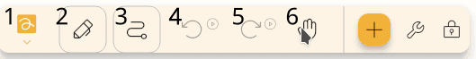

## Tastatur

Es gibt ein paar Verknüpfungen, die Sie im Editor verwenden können.
Einige davon stehen unter den Schaltflächen.

### Allgemein

- `Strg` + `N`: Neue Datei
- `Ctrl` + `Shift` + `N`: Neue Datei aus Vorlage
- `Strg` + `E`: Datei exportieren
- `Ctrl` + `Shift` + `E`: Exportieren Datei (text based)
- `Ctrl` + `Alt` + `Shift` + `E`: Exportieren Datei as image
- `Ctrl` + `Alt` + `Shift` + `E`: Export file as pdf
- `Ctrl` + `Shift` + `P`: Exportieren Datei as pdf
- `Strg` + `Alt` + `S`: Einstellungen öffnen
- `Strg` + `Alt` + `P`: Open Packs

### Projekt

- `Strg` + `K`: Suche öffnen
- `Strg` + `Z`: Rückgängig
- `Strg` + `Y`: Redo
- `Strg` + `Shift` + `P`: Öffnen Sie Wegpunkte Dialog
- `Strg` + `B`: Hintergrunddialog öffnen
- `Strg` + `S`: Speichern
- `Alt` + `S`: Pfad ändern
- `Ctrl` + (`1` - `0`): Wechsele zum Werkzeug
- `Strg` + `+`: Zoom in
- `Strg` + `-`: Verkleinern

## Stift

Standardmäßig ist der Stift wie folgt konfiguriert:

- `Pen`: als Stift konfiguriert.
- `First` (Primärer Knopf, falls unterstützt): Ändern Sie das Handwerkzeug während Sie gedrückt werden.
- (Sekundärer Knopf, falls unterstützt): Wechseln Sie zum zweiten Werkzeug (siehe [Konfigurieren] (#configure) Sektion unten) während Sie ihn gedrückt halten.

## Konfigurieren {#configure}

Sie können Ihre Steuerelemente anpassen, indem Sie ändern, welchen Werkzeugen Ihre Eingaben zugeordnet sind.

**Hinweis:** Eingabekonfigurationen werden ignoriert, während bestimmte Werkzeuge ausgewählt sind, etwa das Lasso-Auswahlwerkzeug, das Rechteck-Auswahlwerkzeug, das Beschriftungswerkzeug und das Bereichswerkzeug.

Gehen Sie zunächst zu `Einstellungen` → `Eingaben` und wählen Sie dann die Eingabemethode aus, die Sie konfigurieren möchten, zum Beispiel `Maus`, `Touch` oder `Stift`. Ihnen wird eine Liste konfigurierbarer Eingaben und der Werkzeuge angezeigt, denen sie aktuell zugeordnet sind.

Nach Auswahl einer Eingabe haben Sie 3 Optionen:

- `Aktives Werkzeug`: Die Eingabe verhält sich wie das aktuell ausgewählte Werkzeug in der Symbolleiste.
- `Handwerkzeug`: Die Eingabe wechselt vorübergehend zum Handwerkzeug, mit dem Sie sich auf der Leinwand bewegen können.
- `Bestimmtes Werkzeug in der Symbolleiste`: Die Eingabe wechselt vorübergehend zu einem Werkzeug in Ihrer Symbolleiste, basierend auf der angegebenen Positionsnummer. Positionen werden von links gezählt. Wenn Sie also Position `1` angeben, wird das erste Werkzeug links ausgewählt. Im Screenshot unten sehen Sie ein Beispiel dafür, wie Positionsnummern gezählt werden. Informationen zum Neuanordnen Ihrer Werkzeuge finden Sie unter [Symbolleiste anpassen](../intro/#customizing-the-toolbar).

