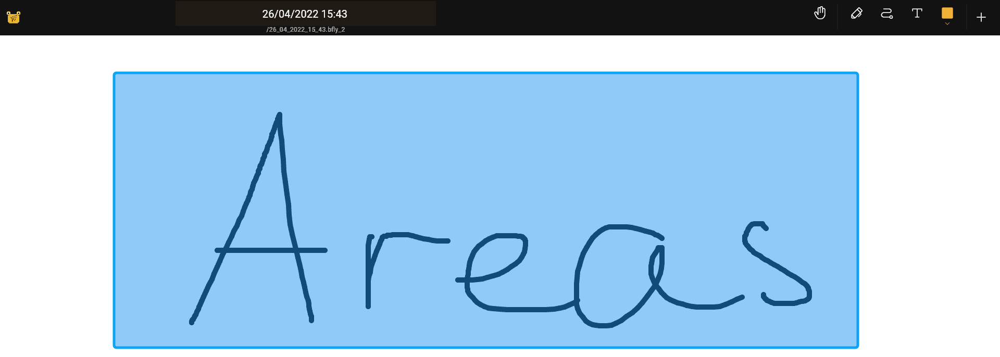

import { Tabs, TabItem } from '@astrojs/starlight/components';
import {Monitor, Plus, TextT, Faders, Folder, Stack, SignOut, SignIn, Trash, Export, PlusCircle, Door, DotsThreeVertical} from "@phosphor-icons/react";
import logo from '/public/img/logo.svg';

## Introduction

Areas are a way to restrict the portion of the canvas that can be modified, allowing you to safely work on a specific region of your document without affecting other regions. You can create areas by using the [Area tool](../tools/area).

## Creating Areas

 With the Area tool selected, draw a rectangle anywhere on the canvas to define a new area. If you do not have the <Monitor className="inline-icon"/> Area tool on your toolbar, see [Customizing the Toolbar](../intro#customizing-the-toolbar).

 After creating an area, you can enter it using the <SignIn className="inline-icon"/> button in the [Context Menu](#the-context-menu).

## The Context Menu

<Tabs syncKey="platform">
    <TabItem label="Desktop">
    You can open the context menu by either right-clicking an area or using the <Monitor className="inline-icon"/> Area section of the Navigator on the left side of the screen.
    </TabItem>
    <TabItem label="Tablet">
    You can open the context menu by either long-tapping an area or using the <Monitor className="inline-icon"/> Area section of the Navigator on the left side of the screen.
    </TabItem>
    <TabItem label="Mobile">
    You can open the context menu by either long-tapping an area or using the <Monitor className="inline-icon"/> Area section in the  Butterfly menu.
    </TabItem>
</Tabs>

The context menu has the following options:

* <TextT className="inline-icon"/> `Rename` - Change the name of the area.
* <SignIn className="inline-icon"/> `Enter the area` - Activate the area, restricting edits to only the contents contained in the area. After entering an area, select this option again to exit it.
* <Trash className="inline-icon"/> `Delete` - Delete the area. This does **not** delete the content within the area.
* <Faders className="inline-icon"/> `Properties` - Change the dimensions of the area.
* <Folder className="inline-icon"/> `Change collection` - Change which [collection](../tools/collection) the area belongs to.
* <Stack className="inline-icon"/> `Convert to layer` - Move the contents of the area to a new [layer](../layers).
* <Export className="inline-icon"/> `Export` - Export the content of the selected area.
* <PlusCircle className="inline-icon"/> `Add to pack` - Add the area to a [pack](../pack).

## Exiting an Area

After entering an area, you can leave it by doing any of the following:
- Tap the <Door className="inline-icon"/> button in the app bar
- Tap the <SignOut className="inline-icon"/> button in the <Monitor className="inline-icon"/> Area section of the Navigator
- After selecting the <Monitor className="inline-icon"/> Area tool, open the context menu and tap <SignOut className="inline-icon"/> Exit the Area.

## Configuring the Area Tool

You can configure the Area tool by selecting the <Monitor className="inline-icon"/> Area tool in the toolbar and then clicking it again. See [Area Tool: Configuration](../tools/area#configuration) for more information.