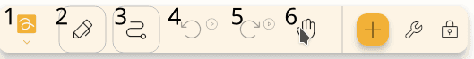

Shortcuts are a way to map specific inputs to an action that influences the editor.

To begin, go to `Settings` → `Inputs` and then select the input method you want to configure, such
as `Mouse`, `Touch`, `Keyboard` or `Pen`. You will be presented with a list of configurable inputs
and the actions they are currently mapped to.

These actions are divided into [tool activators](#tool-activators)
and [document actions](#document-actions).

## Tool activators

You can customize your controls by changing which tools your inputs map to.

**Note:** Tool activators will be ignored while certain tools are selected, such as the Select tool,
the Label tool, and the Area tool.

* `None`: Nothing will happen when using this input.
* `Active Tool`: The input will act as the currently selected tool on the toolbar.
* `Hand Tool`: The input will use the hand tool as a [temporary tool](../#temporary-tools),
  allowing you to move around the canvas.
* `Specific Tool on Toolbar`: The input will use the specified tool on the toolbar as
  a [temporary tool](../#temporary-tools), based on the position you specify. Positions are counted
  starting from the left, so if you specify position `1`, the first tool on the left will be
  selected. See the screenshot below for an example of how position numbers are counted. For
  information about how to reorder your tools,
  see [Customizing the Toolbar](../intro/#customizing-the-toolbar).

## Document actions

* `None`: Nothing happens
* `Long press`: Opens the [Context menu](../context-menu)
* `Search`: Searches the document for pages and tools
* `Undo`: Triggers the [Undo tool](../tools/undo)
* `Redo`: Triggers the [Redo tool](../tools/redo)
* `Background`: Opens the [Background dialog](../background)
* `Save`: Saves the document state
* `Change path`: Changes where the document is stored relative to the `Documents` folder
  in [Data directory](../storage/#data-directory).
* `Zoom in`: Zooms into the canvas at the current position. See [Camera](../utilities/camera).
* `Zoom out`: Zooms out of the canvas at the current position. See [Camera](../utilities/camera).
* `Full screen`: Toggles [Full screen](../tools/full_screen)
* `Hide UI`: Hides everything except the canvas. To leave this view, click the `Exit` button on the
  bottom right.
* `Next page`: Navigates to the next [page](../pages)
* `Previous page`: Navigates to the previous [page](../pages)
* `Select all`: Selects all elements on the canvas
* `Paste`: Pastes the clipboard
* `Tool 1-10`: Switches the active tool to the specified toolbar position

---

## Mouse

### Mouse configurations

|                  Property | Default | Description                                                               |
|--------------------------:|:-------:|:--------------------------------------------------------------------------|
| Hide cursor while drawing |  true   | Hides the mouse pointer while you draw, so it does not cover your stroke. |

### Mouse shortcuts

**Tool activators**:

* `Left`: When holding the left mouse button. Defaults to `Active Tool`
* `Middle`: When holding the mouse wheel. Defaults to `Hand Tool`
* `Rigth`: When holding the right mouse button. Defaults to `Toolbar Position 2` 
* `Back`: When clicking 4th mouse button at the side of some mice.
* `Forward`: When clicking 5th mouse button at the side of some mice.

**Document actions**:

*By default, the mouse document actions are all set to `None`.*

* `Double Left`: A double click on the left mouse button
* `Triple Left`: A triple click on the left mouse button
* `Double Middle`: A double click on the mouse wheel
* `Triple Middle`: A triple click on the mouse wheel
* `Double Right`: A double click on the right mouse button
* `Triple Right`: A triple click on the right mouse button
* `Double Back`: A double click on the 4th mouse button at the side of some mice
* `Triple Back`: A triple click on the 4th mouse button at the side of some mice
* `Double Forward`: A double click on the 5th mouse button at the side of some mice
* `Double Forward`: A triple click on the 5th mouse button at the side of some mice

## Touch

### Touch configurations

|        Property | Default | Description                                                                                 |
|----------------:|:-------:|:--------------------------------------------------------------------------------------------|
|  Input gestures |  true   | Lets you move and zoom the canvas with touch gestures, even while drawing tool is selected. |
| Move on gesture |  true   | Lets multi-touch gestures move the canvas instead of interacting with note content.         |

### Touch shortcuts

**Tool activators**:

* `Touch`: When touching the screen. Defaults to `Active Tool`

**Document actions**:

*By default, the touch document actions are all set to `None`.*

* `Double press action`: A double-tap
* `Triple press action`: A triple-tap

## Keyboard

Keyboard actions are divided into the categories hold shortcuts
for **tool activators**, general and project
for **document actions**.

### Hold shortcuts

*There is no default configuration. You may add any key mappings
to **tool activators**.*

### General

* `Ctrl` + `N`: New file
* `Ctrl` + `Shift` + `N`: New file from template
* `Ctrl` + `E`: Export file
* `Ctrl` + `Shift` + `E`: Export file (text based)
* `Ctrl` + `Alt` + `Shift` + `E`: Export file as image
* `Ctrl` + `Shift` + `P`: Export file as PDF
* `Ctrl` + `Alt` + `E`: Export file as SVG
* `Ctrl` + `Alt` + `P`: Open packs
* `Ctrl` + `Alt` + `S`: Open settings
* `Escape`: Escape

### Project

* `Ctrl` + `K`: Open search
* `Ctrl` + `Z`: Undo
* `Ctrl` + `Y`: Redo
* `Ctrl` + `B`: Open background dialog
* `Ctrl` + `S`: Save
* `Alt` + `S`: Change path
* `Ctrl` + `+`: Zoom in
* `Ctrl` + `-`: Zoom out
* `F11`: Full screen
* `F12`: Hide UI
* `Arrow Right`: Next slide in presentation
* `Arrow Left`: Previous slide in presentation
* `Page Down`: Next page
* `Page Up`: Previous page
* `Ctrl`: Pause presentation
* `Ctrl` + `A`: Select all
* `Ctrl` + `V`: Pastes the clipboard
* `Ctrl` + (`1` - `0`): Switch to tool

## Pen

### Pen configurations

|             Property |              Values              | Description                                                                                                      |
|---------------------:|:--------------------------------:|:-----------------------------------------------------------------------------------------------------------------|
|       Pen only input | Automatic, Always on, Always off | Prevents accidental marks from your hand or mouse when only pen input can draw.                                  |
| Show pen only toggle |           true, false            | Shows a quick pen-only switch in the editor after Butterfly detects a pen.                                       |
|      Ignore pressure |       Never, First, Always       | Controls whether a pen pressure changes the stroke and works around inaccurate pressure readings from some pens. |

### Pen shortcuts

By default, the pen is configured to function with the
following **tool activators**:

* `Pen`: Using the pen normally. Defaults to `Active Tool`
* `Inverted Pen`: Using the pen in inverted mode. Defaults to `Toobar Position 4`
* `First`: While holding its primary button, if supported. Defaults to  `Toobar Position 3` (often path-eraser)
* `Second`: While holding its secondary button, if supported. Defaults to `Toolbar Position 2`

*By default, the pen **document actions** are all set to `None`.*

* `Double Pen`: Double-tapping with a pen
* `Triple Pen`: Triple-tapping with a pen
* `Double Inverted Pen`: Double-tapping with a pen in inverted mode
* `Triple Inverted Pen`: Triple-tapping with using a pen in inverted mode
* `Double First`: Double-tapping with a pen while holding its primary button
* `Triple First`: Triple-tapping with a pen while holding its primary button
* `Double Second`: Double-tapping with a pen while holding its secondary button
* `Triple Second`: Triple-tapping with a pen while holding its primary button