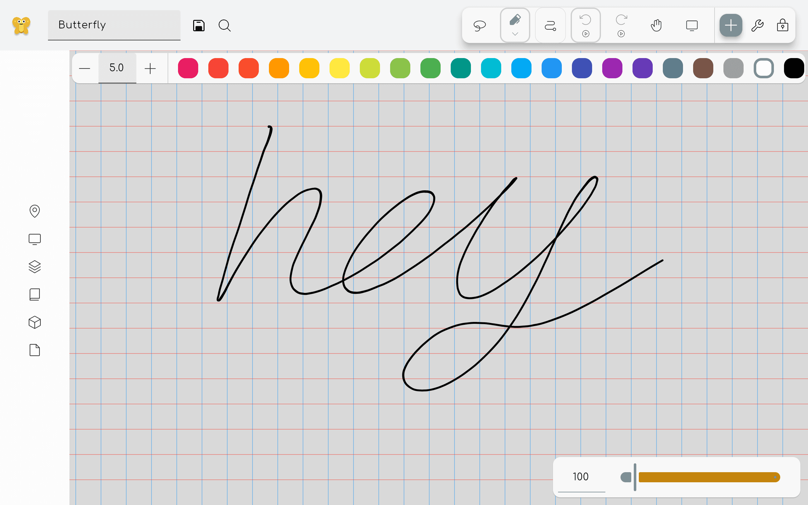
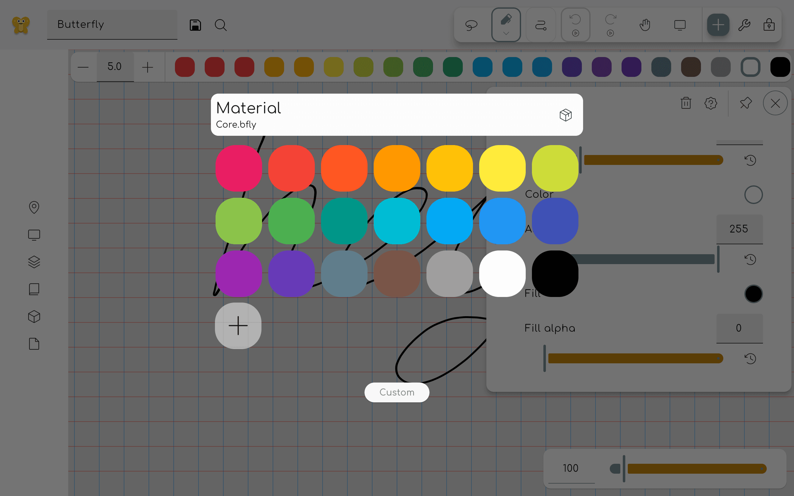
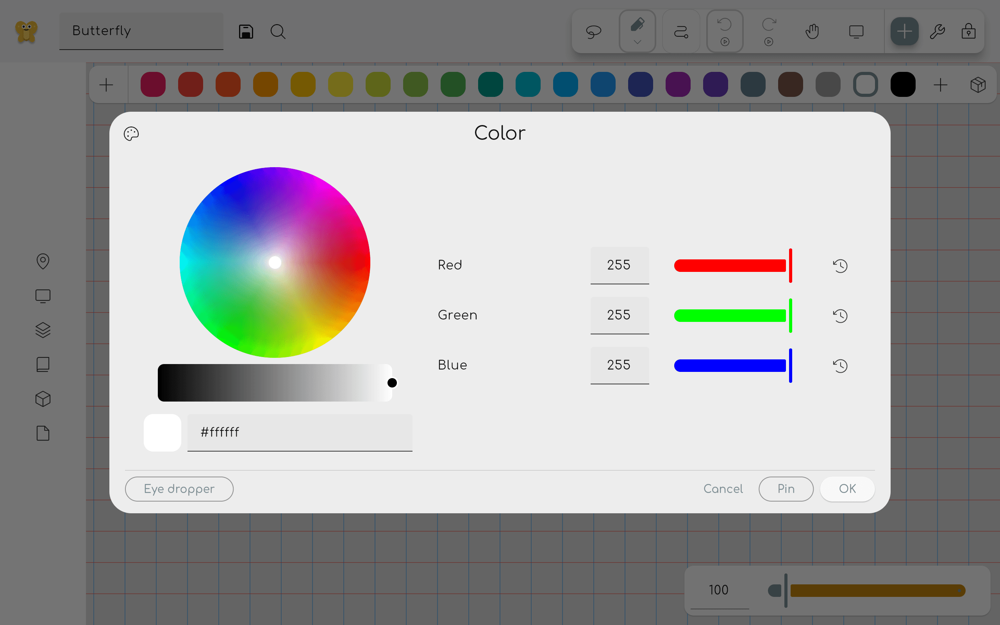

Colors can be selected by using two methods: The color toolbar and the color picker overlay.

To update the color palette, read the [pack documentation](/docs/v2/pack).

## Γραμμή εργαλείων χρωμάτων

If this is enabled in the settings, a color toolbar will be shown when a colorable tool is selected. This toolbar allows you to quickly select a color from a predefined set of colors. Click on the plus icon to select a custom color.

## Color picker overlay

This overlay can be opened by clicking on a property tile that is colorable, for example inside the properties panel of the pen tool. Click on a color to select it. Click on the custom button to open the custom color picker.

If you want to delete a color from the palette, right click on it (or long press on touch devices) and select delete.

### Custom color picker

Here you can select any color you want. On the left you can see a color wheel. Under it you can select the brightness of the color.
Note: if you choose a darker color on the bottom, the wheel selection gets less precise.

Under the brightness slider you can see a preview of the selected color. You can also enter a hex code to select a color. It is specified as `#RRGGBB`, where `RR` is the red value, `GG` is the green value, and `BB` is the blue value in hexadecimal notation.

On the right you can see the red, green and blue values that make up the color. These values can be changed by dragging the sliders or by entering a value between 0 and 255. Pin the color to add it to the color palette.
