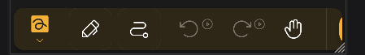

import { Gear,  Plus,  FloppyDisk,  MagnifyingGlass, ScribbleLoop, Pen, Path, ArrowCounterClockwise, ArrowClockwise, Hand, Wrench, Lock} from "@phosphor-icons/react";
import { Tabs, TabItem } from '@astrojs/starlight/components';
import logo from '/public/img/logo.svg';

---

> Bienvenido a Butterfly, la aplicación de notas de código abierto.

Butterfly es una aplicación de toma de notas que apunta a una experiencia unificada en todas las plataformas. Proporciona una interfaz de usuario sencilla con una potente personalización.

## Comenzando

> Puedes usar la barra lateral para navegar rápidamente a través de la wiki.

Para empezar a trabajar en la aplicación, tienes dos opciones:

1. [Downloads](/descarga) la versión de la aplicación que es apropiada para tu plataforma (Butterfly puede ejecutarse en la mayoría de plataformas móviles, de escritorio y web).
2. Usa [versión web](https://web.butterfly.linwood.dev) si no puedes encontrar tu plataforma o si no quieres instalarla en ella. Ver [here](almacenamiento#web) acerca del almacenamiento de archivos en la versión web.

> Una vez que abras la aplicación, sigue leyendo.

## Vista principal

La vista principal se compone de varios elementos

<Tabs syncKey="platform">
    <TabItem label="Desktop">
        
        La parte superior de la pantalla mantiene el banner para actualizaciones, el enlace a esta documentación, y el icono de configuración <Gear className="inline-icon"/>. Finalmente, a la derecha del símbolo de configuración <Gear className="inline-icon"/> tienes un menú desplegable para controlar cuándo aparecerá este banner (siempre/nunca/en actualizaciones).
        La sección "Archivos" en el área principal de la izquierda. Eso, puedes hacer las operaciones típicas:
        - Selecciona el tipo de visualización (cuadrícula o lista)
        - Selecciona el [almacenamiento fuente](.. almacenamiento) de los archivos
        - Ordena el orden de visualización de los archivos
        - Añadir una carpeta, archivo, plantilla, o importar archivos haciendo clic en <Plus className="inline-icon"/> más signo
        - Escriba la ruta directa a la ubicación deseada (el campo Ubicación),
        - Buscar archivos
        Finalmente, a la derecha, tiene la pantalla de inicio rápido con las plantillas disponibles en la ubicación actual. Para una instalación fresca, esto incluye la plantilla clara y oscura
    </TabItem>
    <TabItem label="Mobile">
        ¡Al abrir la mariposa en un dispositivo móvil, se te presentará una pantalla como este
        ! Pantalla de bienvenida primero](welcome_screen_mobile_1. ng)
        La parte superior de la pantalla mantiene el banner para actualizaciones, y debajo de él puedes encontrar el enlace de nentación, y junto a él el icono de configuración <Gear className="inline-icon"/>. Finalmente, a la derecha del símbolo de configuración <Gear className="inline-icon"/> tienes un menú desplegable para controlar cuándo aparecerá este banner (siempre/nunca/en actualizaciones).
        Debajo de ellas, puede encontrar la sección de inicio rápido sosteniendo las plantillas avialables para usted. Por defecto, las plantillas son las plantillas claras y oscuras.
        Desplazándose hacia abajo, verás la interfaz de archivos:
        \
        ! Segunda parte de la pantalla de bienvenida](welcome_screen_mobile_2. ng)  
        La sección "Archivos" en el área principal de la izquierda. Eso, puedes hacer las operaciones típicas:
        - Selecciona el tipo de visualización (cuadrícula o lista)
        - Selecciona el [almacenamiento fuente](.. almacenamiento) de los archivos
        - Ordena el orden de visualización de los archivos
        - Añadir una carpeta, archivo, plantilla, o importar archivos haciendo clic en <Plus className="inline-icon"/> más signo
        - Escriba la ruta directa a la ubicación deseada (el campo Ubicación),
        - Buscar archivos
 </TabItem>
</Tabs>

Una vez que abras un documento seleccionando una plantilla o un archivo existente, llegarás a la **Vista de Documentos**

## Vista del documento

Puede volver desde la vista de documento a la lista de documentos con la acción de atrás de su dispositivo. Al igual que con la vista principal, el documento muestra cambios basados en su dispositivo.

<Tabs syncKey="platform">
    <TabItem label="Desktop">
  en la vista de escritorio. ¡tendrás en la parte superior izquierda la barra de archivos\
  \
  Esto sostiene, de izquierda a derecha, el botón  para abrir el menú. Junto a él está el campo nombre que muestra el nombre de la nota. Puede cambiar el nombre de la nota escribiendo un nuevo nombre en ese campo y guardándolo usando el botón <FloppyDisk className="inline-icon"/> guardar. Finally you can <MagnifyingGlass className="inline-icon"/> search for elements within the note.
  \
  At the top right of the screen you have the toolbar\
  \
  By default this bar has the <ScribbleLoop className="inline-icon"/> lasso tool; the <Pen className="inline-icon"/> pen tool; the <Path className="inline-icon"/> path erase tool; the <ArrowCounterClockwise className="inline-icon"/> undo and <ArrowClockwise className="inline-icon"/> redo butons, and the <Hand className="inline-icon"/> hand tool. Luego tienes el botón <Plus className="inline-icon"/> para añadir elementos a la barra de herramientas, el botón <Wrench className="inline-icon"/> para configurar el documento, y, finalmente, la herramienta <Lock className="inline-icon"/> para ver el zoom y/o la posición de la pantalla.
  ### Notas importantes
  1. Si algunos de los elementos de la barra de herramientas no son visibles para usted, haga clic y arrastre (o deslize) a la izquierda y a la derecha para revelar más herramientas.
  2. Después de seleccionar una herramienta, aparecerá un pequeño menú. Hacer clic largo en la herramienta de nuevo te permitirá arrastrarlo a una nueva posición
  3. Puede añadir más herramientas a la barra de herramientas haciendo clic en el signo <Plus className="inline-icon"/>.
 </TabItem>
 <TabItem label="Mobile">
  en la vista móvil, tendrá en la parte superior de la barra de archivos\
     \
  Esto sostiene, de izquierda a derecha, el botón  para abrir el menú. Junto a él está el campo nombre que muestra el nombre de la nota. Puede cambiar el nombre de la nota escribiendo un nuevo nombre en ese campo y guardándolo usando el botón <FloppyDisk className="inline-icon"/> guardar. Finally you can <MagnifyingGlass className="inline-icon"/> search for elements within the note.
  \
  ¡En la parte inferior de la pantalla tiene la barra de herramientas/
  \
  Por defecto esta barra tiene la herramienta <ScribbleLoop className="inline-icon"/> lasso; la herramienta <Pen className="inline-icon" /> lápiz la herramienta de borrar ruta <Path className="inline-icon"/> ; las butonas <ArrowCounterClockwise className="inline-icon"/> deshacer y <ArrowClockwise className="inline-icon"/> rehacer, y la herramienta <Hand className="inline-icon"/>. Luego tienes el botón <Plus className="inline-icon"/> para añadir elementos a la barra de herramientas, el botón <Wrench className="inline-icon"/> para configurar el documento, y, finalmente, la herramienta <Lock className="inline-icon"/> para ver el zoom y/o la posición de la pantalla.
  ### Notas importantes
  1. Si algunos de los elementos de la barra de herramientas no son visibles para ti, o desliza hacia la izquierda y la derecha para revelar elementos adicionales.
  2. Después de seleccionar una herramienta, aparecerá un pequeño menú para configurarla. Hacer clic largo en la herramienta de nuevo te permitirá arrastrarlo a una nueva posición
  3. Puede añadir más herramientas a la barra de herramientas haciendo clic en el signo <Plus className="inline-icon"/>.
 </TabItem>
</Tabs>
