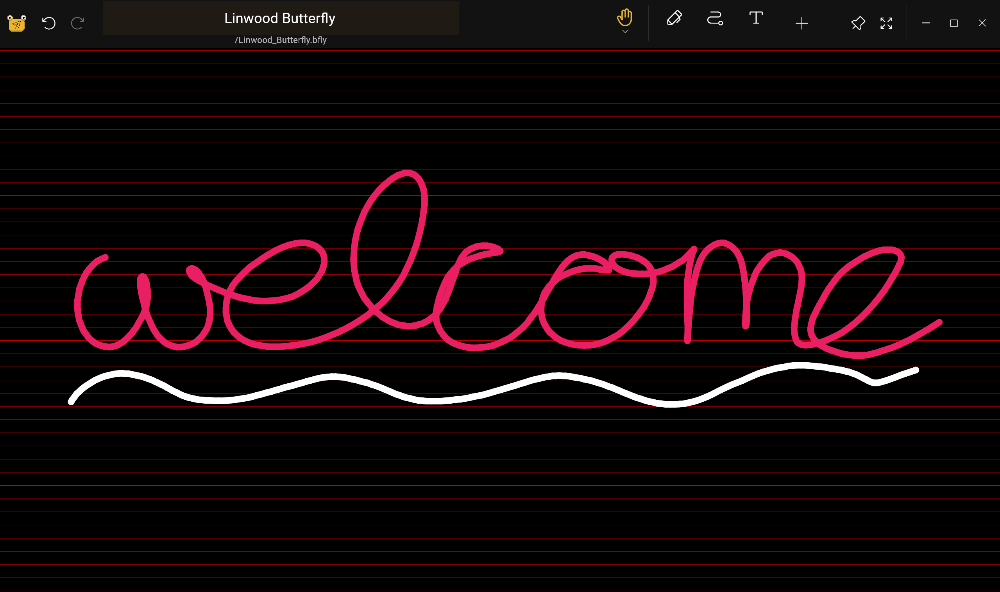

import { Gear,  Plus,  FloppyDisk,  MagnifyingGlass, ScribbleLoop, Pen, Path, ArrowCounterClockwise, ArrowClockwise, Hand, Wrench, Lock} from "@phosphor-icons/react";
import { Tabs, TabItem } from '@astrojs/starlight/components';
import logo from '/public/img/logo.svg';

---

> Tervetuloa Butterfly, opensource note app.

Butterfly on muistiinpanon sovellus, joka tähtää yhtenäiseen kokemukseen kaikilla alustoilla. Se tarjoaa yksinkertaisen käyttöliittymän tehokkaalla muokkauksella.

## Aloittaminen

> Voit käyttää sivupalkkia navigoidaksesi nopeasti wikin kautta.

Jos haluat aloittaa sovelluksen käytön, sinulla on kaksi vaihtoehtoa:

1. [Downloads](/downloads) sovellusversio, joka sopii alustallesi (Butterfly voi ajaa useimmilla mobiili-, työpöytä- ja web-alustoilla).
2. Käytä [web-versio](https://web.butterfly.linwood.dev) jos et löydä alustaasi tai jos et halua asentaa sitä siihen. Katso [here](storage#web) tiedostotallennustilasta web-versiossa.

> Kun olet avannut sovelluksen, jatka lukemista.

## Päänäkymä

Tärkein näkemys koostuu useista tekijöistä

<Tabs syncKey="platform">
    <TabItem label="Desktop">
        
        Näytön yläosassa on päivitysten banneri, linkki näihin asiakirjoihin, ja <Gear className="inline-icon"/> config kuvake. Lopuksi, oikealle <Gear className="inline-icon"/> config symboli sinulla on pudota alas valikko valvoa milloin tämä banneri näkyy (aina / ei päivityksiä).
        The "Files" section in the major area of the left. Siellä, voit tehdä tyypillisiä toimintoja:
        - Valitse näyttötyyppi (ruudukko tai lista)
        - Valitse [lähdetallennus](.. tiedostojen tallennus)
        - Järjestä tiedostojen esitysjärjestys
        - Lisää kansio, tiedostomalli, tai tuo tiedostoja klikkaamalla <Plus className="inline-icon"/> plus merkki
        - Kirjoita suora polku haluttuun paikkaan (Sijaintikenttä),
        - Etsi tiedostoja
        Lopuksi, oikealle, sinulla on nopea käynnistys näyttö malleja, jotka ovat käytettävissä nykyisessä paikassa. Uutta asennusta varten tämä sisältää vaalean ja tumman mallin
    </TabItem>
    <TabItem label="Mobile">
        Kun avaat Butterfly mobiililaitteelle, sinulle esitetään näyttö kuin tämä
        ! Tervetuloa näytön ensimmäinen osa](welcome_screen_mobile_1. ng)
        Näytön yläosassa on päivitysten banneri, ja sen alapuolella löydät documnentation linkin, ja sen vieressä <Gear className="inline-icon"/> config kuvake. Lopuksi, oikealle <Gear className="inline-icon"/> config symboli sinulla on pudota alas valikko valvoa milloin tämä banneri näkyy (aina / ei päivityksiä).
        Alla ne, löydät nopean alun osion pitämällä malleja avialable sinulle. Sivupohjat ovat vaaleita ja tummia malleja.
        Vieritä alas, näet tiedoston käyttöliittymä:
        \
        ! Tervetuloa ruutu toinen osa](welcome_screen_mobile_2. ng)  
        The "Files" -osio vasemman pääosassa. Siellä, voit tehdä tyypillisiä toimintoja:
        - Valitse näyttötyyppi (ruudukko tai lista)
        - Valitse [lähdetallennus](.. tiedostojen tallennus)
        - Järjestä tiedostojen esitysjärjestys
        - Lisää kansio, tiedostomalli, tai tuo tiedostoja klikkaamalla <Plus className="inline-icon"/> plus merkki
        - Kirjoita suora polku haluttuun paikkaan (Sijaintikenttä),
        - Etsi tiedostoja
 </TabItem>
</Tabs>

Kun avaat asiakirjan valitsemalla mallin tai olemassa olevan tiedoston, pääset **Document View** -näkymään

## Asiakirjan Näkymä

Voit palata asiakirjan näkymästä asiakirjan luetteloon, jossa on laitteen takatoiminto (back action of your device). Kuten päänäkymässä, dokumentin näytön muutokset perustuvat laitteeseesi.

<Tabs syncKey="platform">
    <TabItem label="Desktop">
  Työpöydän näkymässä sinulla on tiedostopalkin vasemmassa yläreunassa \
  \
  Tässä on vasemmalta oikealle,  perhonen painiketta avataksesi valikon. Sen vieressä on nimikenttä, joka näyttää huomautuksen nimen. Voit uudelleennimetä merkinnän kirjoittamalla uuden nimen kyseiseen kenttään ja tallentamalla sen käyttämällä <FloppyDisk className="inline-icon"/> -näppäintä. Finally you can <MagnifyingGlass className="inline-icon"/> search for elements within the note.
  \
  Näytön oikeassa yläkulmassa on työkalurivi\
  \
  Oletuksena tällä palkilla on <ScribbleLoop className="inline-icon"/> lasso työkalu; <Pen className="inline-icon"/> kynä työkalu; <Path className="inline-icon"/> polku poistaa työkalun; <ArrowCounterClockwise className="inline-icon"/> kumoa ja <ArrowClockwise className="inline-icon"/> redo butonit ja <Hand className="inline-icon"/> kädentyökalu. Sitten sinulla on <Plus className="inline-icon"/> -painike lisätäksesi elementtejä työkaluriviin, <Wrench className="inline-icon"/> -painikkeeseen, jolla voit määrittää asiakirjan, ja lopuksi <Lock className="inline-icon"/> työkalu näyttääksesi näytön zoomauksen ja/tai sijainnin.
  ### Tärkeitä muistiinpanoja
  1. Jos osa työkalupalkin elementeistä ei näy sinulle, klikkaa ja vedä (tai pyyhkäise) vasemmalle ja oikealle paljastaaksesi lisää työkaluja.
  2. Työkalun valinnan jälkeen ilmestyy pieni valikko. Pitkä klikkaamalla työkalua uudelleen voit vetää sen uuteen kohtaan
  3. Voit lisätä työkaluriviin lisää työkaluja klikkaamalla <Plus className="inline-icon"/> plus -merkkiä.
 </TabItem>
 <TabItem label="Mobile">
  Mobiilinäkymässä sinulla on tiedoston yläreunassa palkki\
     \
  Tässä on vasemmalta oikealle,  perhonen painiketta avataksesi valikon. Sen vieressä on nimikenttä, joka näyttää huomautuksen nimen. Voit uudelleennimetä merkinnän kirjoittamalla uuden nimen kyseiseen kenttään ja tallentamalla sen käyttämällä <FloppyDisk className="inline-icon"/> -näppäintä. Finally you can <MagnifyingGlass className="inline-icon"/> search for elements within the note.
  \
  Näytön alareunassa on työkalurivi\
  \
  Oletuksena tällä palkilla on <ScribbleLoop className="inline-icon"/> lasso työkalu; <Pen className="inline-icon" /> kynä työkalu; <Path className="inline-icon"/> polku poistaa työkalun; <ArrowCounterClockwise className="inline-icon"/> kumoa ja <ArrowClockwise className="inline-icon"/> redo butonit ja <Hand className="inline-icon"/> kädentyökalu. Sitten sinulla on <Plus className="inline-icon"/> -painike lisätäksesi elementtejä työkaluriviin, <Wrench className="inline-icon"/> -painikkeeseen, jolla voit määrittää asiakirjan, ja lopuksi <Lock className="inline-icon"/> työkalu näyttääksesi näytön zoomauksen ja/tai sijainnin.
  ### Tärkeitä muistiinpanoja
  1. Jos osa työkalupalkin elementeistä ei näy sinulle, tai pyyhkäise vasemmalle ja oikealle paljastaaksesi uusia elementtejä.
  2. Työkalun valinnan jälkeen sen määrittämiseen näytetään pieni valikko. Pitkä klikkaamalla työkalua uudelleen voit vetää sen uuteen kohtaan
  3. Voit lisätä työkaluriviin lisää työkaluja klikkaamalla <Plus className="inline-icon"/> plus -merkkiä.
 </TabItem>
</Tabs>
