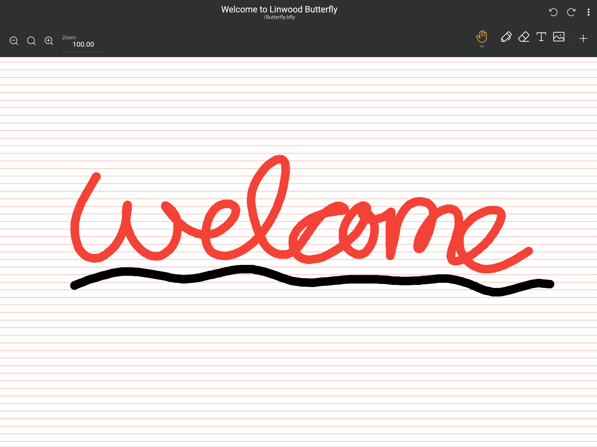

import { Gear,  Plus,  FloppyDisk,  MagnifyingGlass, ScribbleLoop, Pen, Path, ArrowCounterClockwise, ArrowClockwise, Hand, Wrench, Lock} from "@phosphor-icons/react";
import { Tabs, TabItem } from '@astrojs/starlight/components';
import logo from '/public/img/logo.svg';

---

> Bienvenue sur Butterfly, l'application de note opensource.

Butterfly est une application de prise de notes qui vise à une expérience unifiée sur toutes les plateformes. Il fournit une interface utilisateur simple avec une personnalisation puissante.

## Commencer

> Vous pouvez utiliser la barre latérale pour naviguer rapidement à travers le wiki.

Pour commencer à travailler sur l'application, vous avez deux options :

1. [Downloads](/downloads) la version de l'application qui convient à votre plateforme (Butterfly peut fonctionner sur la plupart des plateformes mobile, bureau et web).
2. Utilisez [version web](https://web.butterfly.linwood.dev) si vous ne trouvez pas votre plateforme ou si vous ne voulez pas l'installer. Voir [here](stockage#web) à propos du stockage de fichiers sur la version web.

> Une fois que vous avez ouvert l'application, continuez à lire.

## Vue principale

La vue principale est composée de plusieurs éléments

<Tabs syncKey="platform">
    <TabItem label="Desktop">
        
        Le haut de l'écran contient la bannière pour les mises à jour, le lien vers ces documentations, et l'icône de configuration <Gear className="inline-icon"/>. Enfin, à droite du symbole de configuration <Gear className="inline-icon"/> vous avez un menu déroulant pour contrôler quand cette bannière apparaîtra (toujours/jamais/sur les mises à jour).
        La section "Fichiers" dans la zone principale de gauche. Là, vous pouvez faire les opérations typiques :
        - Sélectionnez le type d'affichage (grille ou liste)
        - Sélectionnez le [stockage source](.. stockage) des fichiers
        - Trier l'ordre d'affichage des fichiers
        - Ajouter un dossier, fichier, modèle, ou importez des fichiers en cliquant sur le signe <Plus className="inline-icon"/> plus
        - Tapez le chemin d'accès direct à l'emplacement souhaité (le champ Emplacement),
        - Rechercher des fichiers
        Enfin, à droite, vous avez l'affichage de démarrage rapide avec les modèles disponibles à l'emplacement actuel. Pour une nouvelle installation, cela inclut le modèle clair et sombre
    </TabItem>
    <TabItem label="Mobile">
        Lorsque vous ouvrez Butterfly sur un appareil mobile, vous serez présenté avec un écran comme ceci
        ! Écran de bienvenue première partie](welcome_screen_mobile_1. ng)
        Le haut de l'écran contient la bannière pour les mises à jour, et plus bas, vous pouvez trouver le lien documentation, et à côté de l'icône de configuration <Gear className="inline-icon"/>. Enfin, à droite du symbole de configuration <Gear className="inline-icon"/> vous avez un menu déroulant pour contrôler quand cette bannière apparaîtra (toujours/jamais/sur les mises à jour).
        Ci-dessous, vous pouvez trouver la section de démarrage rapide tenant les modèles avialable à vous. Par défaut, les modèles sont les modèles clairs et sombres.
        Défilement vers le bas vous verrez l'interface de fichier :
        \
        ! Écran d'accueil deuxième partie](welcome_screen_mobile_2. ng)  
        La section "Fichiers" dans la zone principale de la gauche. There, you can do the typical operations:
        - Select the display type (grid or list)
        - Select the [source storage](../storage) of the files
        - Sort the display order of the files
        - Add a folder, file, template, or import files by clicking the <Plus className="inline-icon"/> plus sign
        - Type the direct path to a desired location (the Location field),
        - Search for files
 </TabItem>
</Tabs>

Une fois un document ouvert en sélectionnant un modèle ou un fichier existant, vous accéderez à la **Vue du document**

## La vue du document

Vous pouvez retourner de la vue du document à la liste des documents avec l'action de retour de votre appareil. Comme pour la vue principale, l'affichage du document est basé sur votre appareil.

<Tabs syncKey="platform">
    <TabItem label="Desktop">
  Dans la vue Bureau, vous aurez en haut à gauche la barre de fichiers\
  \
  Ceci contient, de gauche à droite, le bouton  papillon pour ouvrir le menu. À côté de cela, il y a le champ nom qui affiche le nom de la note. Vous pouvez renommer la note en tapant un nouveau nom dans ce champ et en l'enregistrant en utilisant le bouton <FloppyDisk className="inline-icon"/> Enregistrer. Enfin vous pouvez <MagnifyingGlass className="inline-icon"/> rechercher des éléments dans la note.
  \
  En haut à droite de l'écran, vous avez la barre d'outils\
  \
  Par défaut, cette barre a l'outil lasso <ScribbleLoop className="inline-icon"/> ; l'outil de stylo <Pen className="inline-icon"/> ; l'outil d'effacement du chemin <Path className="inline-icon"/> ; les butons <ArrowCounterClockwise className="inline-icon"/> d'annulation et <ArrowClockwise className="inline-icon"/> et l'outil à la main <Hand className="inline-icon"/>. Ensuite, vous avez le bouton <Plus className="inline-icon"/> pour ajouter des éléments à la barre d'outils, le bouton <Wrench className="inline-icon"/> pour configurer le document, et enfin l'outil <Lock className="inline-icon"/> pour regarder le zoom et/ou la position de l'écran.
  ### Notes importantes
  1. Si certains des éléments de la barre d'outils ne sont pas visibles pour vous, cliquez et faites glisser (ou glisser) vers la gauche et la droite pour révéler d'autres outils.
  2. Après avoir sélectionné un outil, un petit menu apparaît. Un clic long sur l'outil vous permettra de le déplacer vers une nouvelle position
  3. Vous pouvez ajouter plus d'outils à la barre d'outils en cliquant sur le signe <Plus className="inline-icon"/> plus .
 </TabItem>
 <TabItem label="Mobile">
  Dans la vue mobile, vous aurez en haut de la barre de fichiers\
     \
  Ceci contient, de gauche à droite, le bouton  papillon pour ouvrir le menu. À côté de cela, il y a le champ nom qui affiche le nom de la note. Vous pouvez renommer la note en tapant un nouveau nom dans ce champ et en l'enregistrant en utilisant le bouton <FloppyDisk className="inline-icon"/> Enregistrer. Enfin vous pouvez <MagnifyingGlass className="inline-icon"/> rechercher des éléments dans la note.
  \
  En bas de l'écran, vous avez la barre d'outils\
  \
  Par défaut, cette barre a l'outil lasso <ScribbleLoop className="inline-icon"/> ; l'outil de stylo <Pen className="inline-icon" /> ; l'outil d'effacement du chemin <Path className="inline-icon"/> ; les butons <ArrowCounterClockwise className="inline-icon"/> d'annulation et <ArrowClockwise className="inline-icon"/> et l'outil à la main <Hand className="inline-icon"/>. Ensuite, vous avez le bouton <Plus className="inline-icon"/> pour ajouter des éléments à la barre d'outils, le bouton <Wrench className="inline-icon"/> pour configurer le document, et enfin l'outil <Lock className="inline-icon"/> pour regarder le zoom et/ou la position de l'écran.
  ### Notes importantes
  1. Si certains éléments de la barre d'outils ne sont pas visibles pour vous, ou glissez vers la gauche et la droite pour révéler d'autres éléments.
  2. Après avoir sélectionné un outil, un petit menu apparaîtra pour le configurer. Un clic long sur l'outil vous permettra de le déplacer vers une nouvelle position
  3. Vous pouvez ajouter plus d'outils à la barre d'outils en cliquant sur le signe <Plus className="inline-icon"/> plus .
 </TabItem>
</Tabs>
