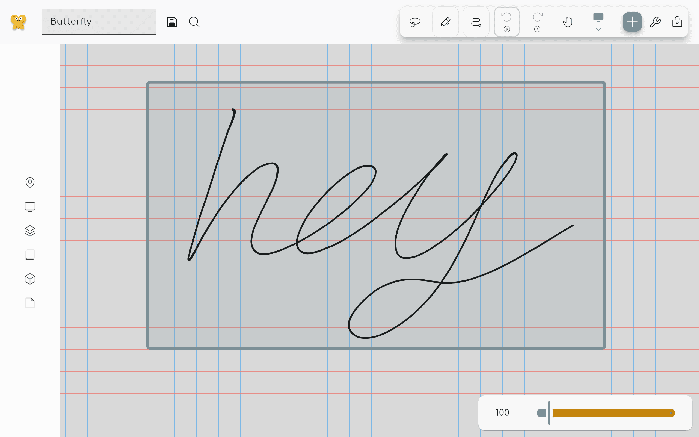

import {Monitor} from "@phosphor-icons/react";

## Introduzione

Le aree sono un modo per limitare le dimensioni della tela. È possibile creare aree utilizzando il [strumento area](../tools/area). Se si fa clic sullo sfondo è possibile aprire la finestra di dialogo elenco area utilizzando il menu di scelta rapida.

## Creazione ed eliminazione di aree

Mentre è possibile modificare direttamente il contenuto sulla tela, è comune che si desidera limitare la regione in cui è possibile modificare il contenuto, o che si desidera che ot sia in grado di accedere rapidamente a una parte del documento. Per questo, hai lo strumento <Monitor className="inline-icon"/> Area. Come spiegato nella [sezione Introduzione](../), potrebbe essere necessario aggiungere il pulsante <Monitor className="inline-icon"/> area alla barra degli strumenti. Utilizzando lo strumento [area tool](../tools/area), è possibile disegnare un rettangolo in qualsiasi punto della superficie per poi definire l'area.

## Più controllo

È possibile definire ulteriormente lo strumento di area facendo clic di nuovo sul pulsante <Monitor className="inline-icon"/>. Lì è possibile definire la larghezza, l'altezza o il rapporto di aspetto delle aree.

## Il menu contestuale dell'area

 Dopo aver disegnato un'area, è possibile fare clic o toccare a lungo sul tocco visualizzare l'area per aprire un menu contestuale con le seguenti opzioni:

- `Name` - Dare all'area un nome che è convincente per voi da usare.
- `Entra nell'area` - Consente di modificare il contenuto solo annoiato da quest'area.
- `Delete` - Elimina l'area. Questo _non_ cancella il contenuto all'interno di questa area
- `Export` - Esporta il contenuto dell'area selezionata.
- `Aggiungi al pacchetto` - Aggiungi l'area ad un [pack](../pack)

## Un'altra opzione

Un'altra opzione per utilizzare il navigatore di area è sul menu a sinistra, o sul menu delle farfalle se si utilizza una piattaforma mobile.
