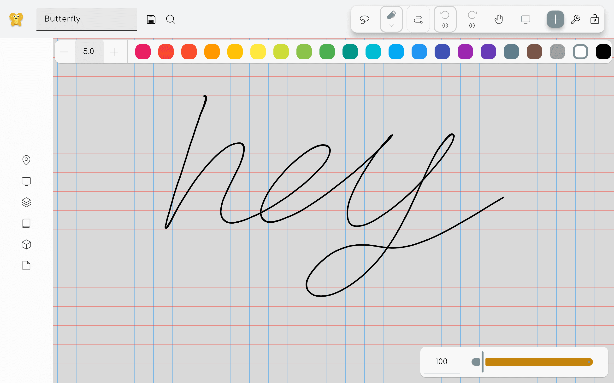
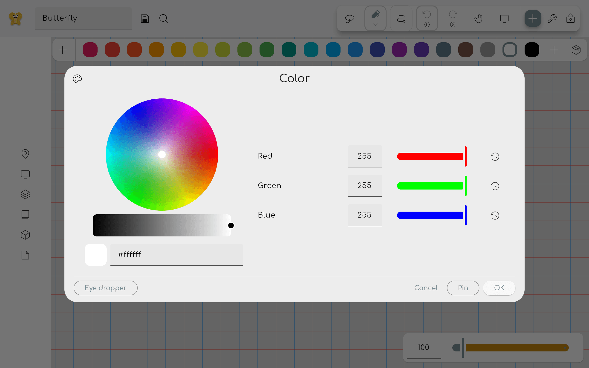

Colors can be selected by using two methods: The color toolbar and the color picker overlay.

To update the color palette, read the [pack documentation](/docs/v2/pack).

For some [surface tools](../add/#surfaces) like the [Pen](../tools/pen/), [Shape](../tools/shape/)
and [Polygon](../tools/polygon) tools, you can further customize the coloring of the tool. This
section will cover the different modes for both the **color** and the **fill** properties with
gradients or images. See [Further customization](#further-customization).

## Barra dei colori

If this is enabled in the settings, a color toolbar will be shown when a colorable tool is selected.
This toolbar allows you to quickly select a color from a predefined set of colors. Click on the plus
icon to select a custom color.

## Color picker overlay

This overlay can be opened by clicking on a property tile that is colorable, for example inside the
properties panel of the pen tool. Click on a color to select it. Click on the custom button to open
the custom color picker.

If you want to delete a color from the palette, right click on it (or long press on touch devices)
and select delete.

### Custom color picker

Here you can select any color you want. On the left you can see a color wheel. Under it you can
select the brightness of the color.
Note: if you choose a darker color on the bottom, the wheel selection gets less precise.

Under the brightness slider you can see a preview of the selected color. You can also enter a hex
code to select a color. It is specified as `#RRGGBB`, where `RR` is the red value, `GG` is the green
value, and `BB` is the blue value in hexadecimal notation.

On the right you can see the red, green and blue values that make up the color. These values can be
changed by dragging the sliders or by entering a value between 0 and 255. Pin the color to add it to
the color palette.

You can use the buttons above to toggle between RGB, HSV, and HSL views.

Clicking the Eye dropper button adds the [Eye dropper tool](../tools/eye_dropper) as
a [temporary tool](../tools#temporary-tools).

---

## Further customization {#further-customization}

## Solid Color

Normal Strokes

| Proprietà | Predefinito | Descrizione                                                     |
| --------: | :---------: | :-------------------------------------------------------------- |
|    Colore |     Nero    | The color of the property                                       |
|      Alfa |   255 / 0   | The opacity of the color                                        |
|      Blur |      0      | How much the color transition to the background will be blurred |

## Image, SVG

Draw the imported image with your strokes. For no filter use white and alpha value at 255.

|      Proprietà |      Predefinito     | Descrizione                                                                   |
| -------------: | :------------------: | :---------------------------------------------------------------------------- |
|           Tint |         White        | The color filter.                                             |
|           Alfa |        255 / 0       | The opacity of the color. How transparent the image should be |
|           Blur |           0          | How much the color transition to the background will be blurred               |
| Scala immagine | 0.25 | How big the image should be                                                   |

## Gradiente

Make your strokes transition between colors

### Linear Gradient

|      Proprietà |                   Predefinito                   | Descrizione                                                                                                                                        |
| -------------: | :---------------------------------------------: | :------------------------------------------------------------------------------------------------------------------------------------------------- |
|         Inizia |             (0,0)            | Starting position of the linear-gradient axis; percentually relative to the top left corner                                                        |
|           Fine |             (1,0)            | End position of the linear-gradient axis; percentually relative to the top left corner                                                             |
| Arresto colore | 2 Color stops (Black, White) | The offset of a Color stop percentually defines where along the gradient axis a color is placed. There are color and alpha options |

### Radial Gradient

|      Proprietà |                          Predefinito                         | Descrizione                                                                                                                                                                  |
| -------------: | :----------------------------------------------------------: | :--------------------------------------------------------------------------------------------------------------------------------------------------------------------------- |
|         Centro | (0.5,0.5) | Position of the boundary circle's geometric middle at 100% offset, relative to the element bounds.                                                           |
|  Center radius |                      0.5                     | Radius of the boundary circle, relative to half the element bounding box's diagonal.                                                                         |
|    Focal Point |            off (same as center)           | Position where the 0% offset is placed, relative to the element bounds. If it differs from the center, an ellipse forms instead of a circle. |
|   Focal radius |                               0                              | Radius of the inner circle where the offset is 0%, relative to half the element bounding box's diagonal. Beyond it, the offset increases.    |
| Arresto colore |        2 Color stops (Black, White)       | The offset of a Color stop percentually defines where between focal point and the boundary the color is placed. There are color and alpha options            |
