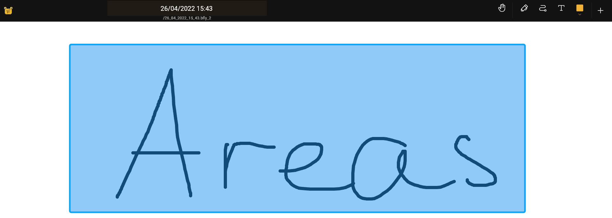

import {Monitor} from "@phosphor-icons/react";

## はじめに

エリアはキャンバスのサイズを制限する方法です。 format@@0(../tools/area) を使用してエリアを作成できます。 背景をクリックすると、コンテキストメニューを使用してエリアリストダイアログを開くことができます。

## エリアの作成と削除

キャンバス上のコンテンツを直接編集できます。 内容を変更できる領域を制限したいのが一般的です ドキュメントの一部に素早くアクセスできるようにしたいということです そのためには、 <Monitor className="inline-icon"/> エリアツールがあります。 As explained in the [introduction section](../), you might need to add the <Monitor className="inline-icon"/> area button to your toolbar. format@@0(../tools/area) を使用すると、キャンバス上の任意の場所に長方形を描画して、エリアを定義できます。

## より多くのコントロール

<Monitor className="inline-icon"/> エリアボタンを再度クリックすることで、エリアツールをさらに定義することができます。 そこで、エリアの固定幅、高さ、またはアスペクト比を定義できます。

## エリアのコンテキストメニュー

 領域を描画した後、クリックまたは長押しで領域を表示すると、次のオプションがあるコンテキストメニューが開きます。

- `Name` - あなたが使用するために便利な名前をエリアに与えます。
- `領域を入力` - この領域で囲まれたコンテンツのみ編集できます。
- `Delete` - 領域を削除します。 このエリア内のコンテンツは削除されません
- `Export` - 選択した領域の内容をエクスポートします。
- `Add to pack` - Add the area to a [pack](../pack)

## 別のオプション

エリアナビゲーターを使用する別のオプションは、左側のメニューにあります。 またはバタフライメニューでモバイルプラットフォームを使用している場合。
