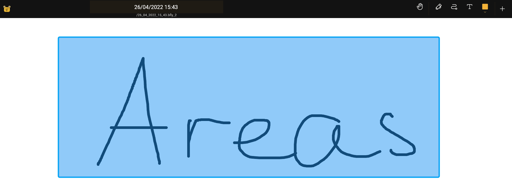

import {Monitor} from "@phosphor-icons/react";

## Introduksjon

Områder er en måte å begrense størrelsen på lerretet. Du kan opprette områder ved å bruke [area tool](../tools/area). Hvis du klikker på bakgrunnen, kan du åpne områdeliste dialogen ved hjelp av kontekstmenyen.

## Opprette og slette områder

Mens du kan redigere innholdet på lerretet, kan du direkte det er vanlig at du vil begrense regionen du kan endre innholdet, eller at du vil at ot skal være i stand til å raskt få tilgang til en del av dokumentet. Dette har du <Monitor className="inline-icon"/> område verktøyet. Som forklart i [introduksjonen](../), må du kanskje legge til <Monitor className="inline-icon"/> områdeknappen til din verktøylinje. Ved hjelp av [area tool](../tools/area) kan du tegne rektangel hvor som helst på lerretet for deretter å definere området.

## Mer kontroll

Du kan definere nærmere områdeverktøy ved å klikke igjen på <Monitor className="inline-icon"/> område-knappen. Der kan du definere områdets faste bredde, høyde eller størrelsesforhold.

## Landets kontekstmeny

 Etter å ha tegnet et område, kan du klikke lenge på berøring av området for å åpne en kontekstmeny med følgende alternativer:

- 'Navn' - Gi området et navn som er overbevist for deg å bruke.
- `Angi området` - lar deg bare redigere innhold som kun kjøres av dette området.
- `Slett` - Slett området. Dette _ikke_ slett innholdet innenfor dette området
- `Eksport` - Eksporter innholdet i det valgte området.
- `Legg til i pakke` - Legg til området til [pack](../pack)

## Et annet alternativ

Et annet alternativ til deg for å bruke områdetavigereren er på venstre meny, eller på sommerfuge-menyen hvis du bruker en mobil plattform.
