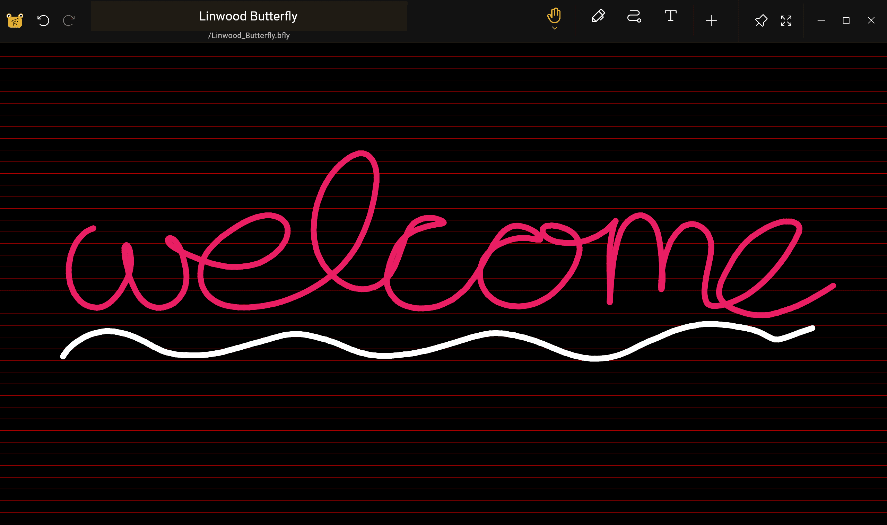
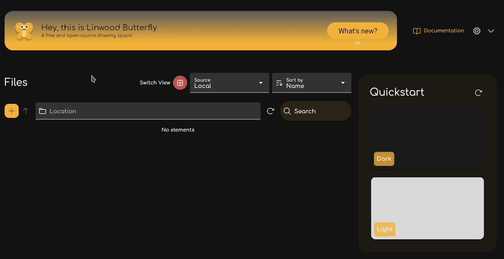

import { Gear,  Plus,  FloppyDisk,  MagnifyingGlass, ScribbleLoop, Pen, Path, ArrowCounterClockwise, ArrowClockwise, Hand, Wrench, Lock} from "@phosphor-icons/react";
import { Tabs, TabItem } from '@astrojs/starlight/components';
import logo from '/public/img/logo.svg';

---

> Witamy w Butterfly, aplikacji "opensource notatka".

Butterfly to notatka z aplikacją, która ma na celu ujednolicenie doświadczenia na wszystkich platformach. Zapewnia prosty interfejs użytkownika z potężnym dostosowywaniem.

## Pierwsze kroki

> Możesz użyć paska bocznego, aby szybko nawigować przez wiki.

Aby rozpocząć pracę nad aplikacją, masz dwie opcje:

1. [Downloads](/downloads) wersja aplikacji, która jest odpowiednia dla Twojej platformy (Butterfly może działać na większości platform mobilnych, stacjonarnych i internetowych).
2. Użyj [wersji internetowej](https://web.butterfly.linwood.dev) jeśli nie możesz znaleźć swojej platformy lub jeśli nie chcesz na niej zainstalować. Zobacz [here](Storage#web) na temat przechowywania plików w wersji internetowej.

> Po otwarciu aplikacji, kontynuuj czytanie.

## Widok główny

Główny widok składa się z kilku elementów

<Tabs syncKey="platform">
    <TabItem label="Desktop">
        
        The top of the screen holds the banner for updates, the link to this documentations, and the <Gear className="inline-icon"/> config icon. Na koniec, po prawej stronie symbolu konfiguracji <Gear className="inline-icon"/> masz rozwijane menu do kontrolowania, kiedy ten baner pojawi się (zawsze/nigdy/nigdy/na aktualizacjach).
        Sekcja "Pliki" w głównej części po lewej stronie. Tam możesz wykonać typowe operacje:
        - Wybierz typ wyświetlacza (siatki lub listy)
        - Wybierz [pamięć źródłową](.. pamięta) plików
        - Sortuj kolejność wyświetlania plików
        - Dodaj folder, plik, szablon, lub zaimportuj pliki klikając <Plus className="inline-icon"/> plus znak
        - Wpisz bezpośrednią ścieżkę do żądanej lokalizacji (pole lokalizacji),
        - Szukaj plików
        Wreszcie, po prawej, masz szybki ekran startowy z szablonami dostępnymi w bieżącej lokalizacji. Dla świeżej instalacji zawiera jasny i ciemny szablon
    </TabItem>
    <TabItem label="Mobile">
        Podczas otwierania Butterfly na urządzeniu mobilnym zostaniesz zaprezentowany z ekranem jako
        ! Ekran powitalny](welcome_screen_mobile_1. ng)
        Górna część ekranu utrzymuje baner do aktualizacji, i poniżej niego możesz znaleźć link dokumnentation i obok ikony <Gear className="inline-icon"/>. Na koniec, po prawej stronie symbolu konfiguracji <Gear className="inline-icon"/> masz rozwijane menu do kontrolowania, kiedy ten baner pojawi się (zawsze/nigdy/nigdy/na aktualizacjach).
        Poniżej znajdziesz sekcję szybkiego startu, trzymając szablony w znacznym stopniu dla Ciebie. Przez defaule szablony są jasnymi i ciemnymi szablonami.
        Przewijanie w dół, zobaczysz interfejs pliku:
        \
        ! Druga część ekranu powitalnego](welcome_screen_mobile_2. ng)  
        Sekcja "Pliki" w głównym obszarze po lewej stronie. Tam możesz wykonać typowe operacje:
        - Wybierz typ wyświetlacza (siatki lub listy)
        - Wybierz [pamięć źródłową](.. pamięta) plików
        - Sortuj kolejność wyświetlania plików
        - Dodaj folder, plik, szablon, lub zaimportuj pliki klikając <Plus className="inline-icon"/> plus znak
        - Wpisz bezpośrednią ścieżkę do żądanej lokalizacji (pole lokalizacji),
        - Szukaj plików
 </TabItem>
</Tabs>

Po otwarciu dokumentu wybierając szablon lub istniejący plik, przejdziesz do **widoku dokumentu**

## Widok dokumentu

Możesz wrócić z widoku dokumentu do listy dokumentów z akcją wsteczną urządzenia. Tak jak w widoku głównym, dokument wyświetla zmiany w oparciu o Twoje urządzenie.

<Tabs syncKey="platform">
    <TabItem label="Desktop">
  w widoku pulpitu, będziesz miał w lewym górnym rogu paska plików\
  \
  To trzyma, od lewej do prawej, przycisk motyla  , aby otworzyć menu. Obok niego jest pole nazwy, które wyświetla nazwę notatki. Możesz zmienić nazwę notatki, wpisując nową nazwę w tym polu i zapisując ją za pomocą przycisku <FloppyDisk className="inline-icon"/>. Na koniec możesz <MagnifyingGlass className="inline-icon"/> wyszukać elementy w notatce.
  \
  W prawym górnym rogu ekranu masz pasek narzędzi\
  \
  Domyślnie ten pasek posiada narzędzie laserowe <ScribbleLoop className="inline-icon"/> ; narzędzie pióra <Pen className="inline-icon"/> , narzędzie do usuwania ścieżki <Path className="inline-icon"/> ; cofnij <ArrowCounterClockwise className="inline-icon"/> i <ArrowClockwise className="inline-icon"/> powtórz butony, oraz ręczne narzędzie <Hand className="inline-icon"/>. Następnie masz przycisk <Plus className="inline-icon"/> aby dodać elementy do paska narzędzi, przycisk <Wrench className="inline-icon"/> aby skonfigurować dokument, i wreszcie narzędzie <Lock className="inline-icon"/> do oglądania powiększenia i/lub pozycji ekranu.
  ### Ważne uwagi
  1. Jeśli część elementu na pasku narzędzi nie jest dla Ciebie widoczna, kliknij i przeciągnij (lub przesuń) w lewo i w prawo, aby wyświetlić kolejne narzędzia.
  2. Po wybraniu narzędzia pojawi się małe menu. Długie kliknięcie narzędzia ponownie pozwoli przeciągnąć go do nowej pozycji
  3. Możesz dodać więcej narzędzi do paska narzędzi, klikając znak <Plus className="inline-icon"/> plus.
 </TabItem>
 <TabItem label="Mobile">
  w widoku mobilnym, będziesz mieć na górze paska plików\
     \
  To trzyma, od lewej do prawej, przycisk motyla  , aby otworzyć menu. Obok niego jest pole nazwy, które wyświetla nazwę notatki. Możesz zmienić nazwę notatki, wpisując nową nazwę w tym polu i zapisując ją za pomocą przycisku <FloppyDisk className="inline-icon"/>. Na koniec możesz <MagnifyingGlass className="inline-icon"/> wyszukać elementy w notatce.
  \
  Na dole ekranu masz pasek narzędzi\
  \
  Domyślnie ten pasek posiada narzędzie laserowe <ScribbleLoop className="inline-icon"/> ; narzędzie pióra <Pen className="inline-icon" /> , narzędzie do usuwania ścieżki <Path className="inline-icon"/> ; cofnij <ArrowCounterClockwise className="inline-icon"/> i <ArrowClockwise className="inline-icon"/> powtórz butony, oraz ręczne narzędzie <Hand className="inline-icon"/>. Następnie masz przycisk <Plus className="inline-icon"/> aby dodać elementy do paska narzędzi, przycisk <Wrench className="inline-icon"/> aby skonfigurować dokument, i wreszcie narzędzie <Lock className="inline-icon"/> do oglądania powiększenia i/lub pozycji ekranu.
  ### Ważne uwagi
  1. Jeśli część elementu na pasku narzędzi nie jest widoczna lub przesuń palcem w lewo i w prawo, aby wyświetlić kolejne elementy.
  2. Po wybraniu narzędzia pojawi się małe menu, aby go skonfigurować. Długie kliknięcie narzędzia ponownie pozwoli przeciągnąć go do nowej pozycji
  3. Możesz dodać więcej narzędzi do paska narzędzi, klikając znak <Plus className="inline-icon"/> plus.
 </TabItem>
</Tabs>
