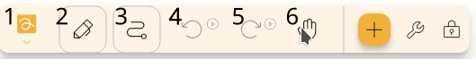

## Keyboard

Det finns några genvägar som du kan använda i editorn.
Några av dem är skrivna under knapparna.

### Allmänt

- `Ctrl` + `N`: Ny fil
- `Ctrl` + `Shift` + `N`: Ny fil från mallen
- `Ctrl` + `E`: Exportera fil
- Nightly (2.4): `Ctrl` + `Shift` + `E`: Export file (text based)
- `Ctrl` + `P`: Skriv ut fil
- `Ctrl` + `Shift` + `E` (Nightly (2.4): `Ctrl` + `Alt` + `Shift` + `E`): Export file as image
- `Ctrl` + `Alt` + `E`: Exportera fil som svg
- `Ctrl` + `Alt` + `Shift` + `E` (Nightly (2.4): `Ctrl` + `Shift` + `P`): Export file as pdf
- `Ctrl` + `Alt` + `P`: Öppna paket
- `Ctrl` + `Alt` + `S`: Öppna inställningar

### Projekt

- `Ctrl` + `K`: Open search
- `Ctrl` + `Z`: Ångra
- `Ctrl` + `Y`: Gör om
- `Ctrl` + `Shift` + `P`: Öppna waypoints dialogrutan
- `Ctrl` + `B`: Öppna bakgrundsdialogrutan
- `Ctrl` + `S`: Spara
- `Alt` + `S`: Ändra sökväg
- `Ctrl` + (`1` - `0`): Växla till verktyget
- `Ctrl` + `+`: Zooma in
- `Ctrl` + `-`: Zooma ut

## Penna

Som standard är pennan konfigurerad att fungera som följande:

- `Pen`: konfigurerad som penna.
- `First` (Primär knapp, om det stöds): Ändra till handverktyg medan du trycker.
- `Second` (Secondary button, if supported): Change to second tool (see [configure](#configure) section below) while pressed.

## Configuring {#configure}

You can customize your controls by changing which tools your inputs map to.

**Note:** Input configurations will be ignored while certain tools are selected, such as the Lasso Select tool, the Rectangle Select tool, the Label tool, and the Area tool.

To begin, go to `Settings` → `Inputs` and then select the input method you want to configure, such as `Mouse`, `Touch`, or `Pen`. You will be presented with a list of configurable inputs and the tools they are currently mapped to.

After selecting an input, you will have 3 options:

- `Active Tool`: The input will act as the currently selected tool on the toolbar.
- `Hand Tool`: The input will temporarily switch to the hand tool, allowing you to move around the canvas.
- `Specific Tool on Toolbar`: The input will temporarily switch to a tool on your toolbar, based on the position number you specify. Positions are counted starting from the left, so if you specify position `1`, the first tool on the left will be selected. See the screenshot below for an example of how position numbers are counted. For information about how to reorder your tools, see [Customizing the Toolbar](../intro/#customizing-the-toolbar).

