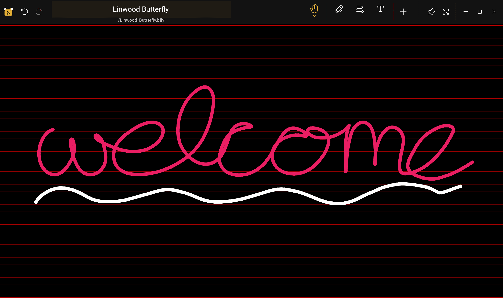
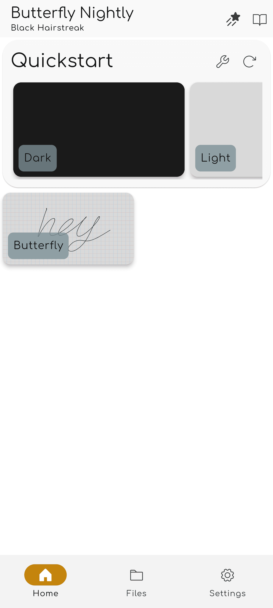

import { Gear,  Plus,  FloppyDisk,  MagnifyingGlass, ScribbleLoop, Pen, Path, ArrowCounterClockwise, ArrowClockwise, Hand, Wrench, Lock} from "@phosphor-icons/react";
import { Tabs, TabItem } from '@astrojs/starlight/components';
import logo from '/public/img/logo.svg';

---

> Ласкаво просимо в Butterfly, додаток для нотаток з відкритим початковим кодом.

Метелик та нотатка, який надає можливість отримати доступ до єдиного доступу на всіх платформах. Він надає простий інтерфейс при потужному налаштування.

## Початок роботи

> Ви можете використовувати бічну панель, щоб швидко орієнтуватися в wiki.

Для того, щоб почати роботу над додатком у вас є два варіанти:

1. [Downloads](/downloads) версія додатку, відповідна до вашої платформи (Butterfly може працювати на більшості мобільних, комп'ютерних платформах та веб-платформі).
2. Використовуйте [веб-версія](https://web.butterfly.linwood.dev) якщо ви не можете знайти вашу платформу, або якщо ви не хочете її встановити. See [here](storage#web) about file storage on the web version.

> Як тільки ви відкриєте програму, продовжуйте читати.

## Основний вигляд

Головний вигляд складається з декількох елементів

<Tabs syncKey="platform">
    <TabItem label="Desktop">
        
        The top of the screen holds the banner for updates, the link to this documentations, and the <Gear className="inline-icon"/> config icon. Нарешті, праворуч від символу відповідності з <Gear className="inline-icon"/> у вас спадне меню для контролю, коли цей банер з'явиться (завжди/ніколи/при оновленні).
        Розділ "Файли" на головній ділянці зліва. There, you can do the typical operations:
        - Select the display type (grid or list)
        - Select the [source storage](../storage) of the files
        - Sort the display order of the files
        - Add a folder, file, template, or import files by clicking the <Plus className="inline-icon"/> plus sign
        - Type the direct path to a desired location (the Location field),
        - Search for files
        Finally, to the right, you have the quick start display with the templates available in the current location. For a fresh install this includes the light and dark template
    </TabItem>
    <TabItem label="Mobile">
        When opening Butterfly on a mobile device you will be presented with a screen as this
        
        The top of the screen holds the banner for updates, and below it you can find the documnentation link, and next to it the <Gear className="inline-icon"/> config icon. Нарешті, праворуч від символу відповідності з <Gear className="inline-icon"/> у вас спадне меню для контролю, коли цей банер з'явиться (завжди/ніколи/при оновленні).
        Нижче наведено список, ви можете знайти швидкий старт, що тримає шаблони для вас готові. Охоплюючи захист, шаблони - це світла й темні шаблони.
        Прокручування вниз, ви побачите інтерфейс файлу:
        \
        ! Вітаю другу частину екрана](welcome_screen_mobile_2. ng)  
        Розділ "Файли" в основній зоні зліва. There, you can do the typical operations:
        - Select the display type (grid or list)
        - Select the [source storage](../storage) of the files
        - Sort the display order of the files
        - Add a folder, file, template, or import files by clicking the <Plus className="inline-icon"/> plus sign
        - Type the direct path to a desired location (the Location field),
        - Search for files
 </TabItem>
</Tabs>

Після відкриття документа обравши шаблон або наявний файл, ви отримаєте **Перегляд документа**

## Документ

Ви можете повернутися з переліку документів до списку документів з зворотною дією вашого пристрою. Як і з основним переглядом, відображені зміни документа на основі вашого пристрою.

<Tabs syncKey="platform">
    <TabItem label="Desktop">
  In the Desktop view, you'll have at the top left the file bar\
  \
  This holds, from left to right, the  butterfly button to open the menu. Далі біля цього поля "Назва" відображається назва нотатки. You can rename the note by typing a new name into that field and saving it using the <FloppyDisk className="inline-icon"/> save button. Нарешті ви можете <MagnifyingGlass className="inline-icon"/> шукати елементи всередині нотатки.
  \
  At the top right of the screen you have the toolbar\
  \
  By default this bar has the <ScribbleLoop className="inline-icon"/> lasso tool; the <Pen className="inline-icon"/> pen tool; the <Path className="inline-icon"/> path erase tool; the <ArrowCounterClockwise className="inline-icon"/> undo and <ArrowClockwise className="inline-icon"/> redo butons, and the <Hand className="inline-icon"/> hand tool. Then you have the <Plus className="inline-icon"/> button to add elements to the tool bar, the <Wrench className="inline-icon"/> button to configure the document, and finally the <Lock className="inline-icon"/> tool to look the zoom and/or the position of the screen.
  ### Important notes
  1. Якщо якийсь елемент на панелі інструментів не видно вам, перетягніть (або плавайте) вліво та вправо для розкриття інших інструментів.
  2. Після вибору інструменту з'явиться невелике меню. Довге натискання на інструменті знову дозволить перетягнути його на нове положення
  3. Ви можете додати більше інструментів для панелі інструментів, натиснувши <Plus className="inline-icon"/> плюс знак.
 </TabItem>
 <TabItem label="Mobile">
  In the mobile view, you'll have at the top the file bar\
     \
  This holds, from left to right, the  butterfly button to open the menu. Далі біля цього поля "Назва" відображається назва нотатки. You can rename the note by typing a new name into that field and saving it using the <FloppyDisk className="inline-icon"/> save button. Нарешті ви можете <MagnifyingGlass className="inline-icon"/> шукати елементи всередині нотатки.
  \
  At the bottom of the screen you have the toolbar\
  \
  By default this bar has the <ScribbleLoop className="inline-icon"/> lasso tool; the <Pen className="inline-icon" /> pen tool; the <Path className="inline-icon"/> path erase tool; the <ArrowCounterClockwise className="inline-icon"/> undo and <ArrowClockwise className="inline-icon"/> redo butons, and the <Hand className="inline-icon"/> hand tool. Then you have the <Plus className="inline-icon"/> button to add elements to the tool bar, the <Wrench className="inline-icon"/> button to configure the document, and finally the <Lock className="inline-icon"/> tool to look the zoom and/or the position of the screen.
  ### Important notes
  1. Якщо якийсь елемент на панелі інструментів не видно вам або проведіть ліворуч і праворуч, щоб показати подальші елементи.
  2. Після вибору інструменту дрібне меню з'явиться для налаштування його. Довге натискання на інструменті знову дозволить перетягнути його на нове положення
  3. Ви можете додати більше інструментів для панелі інструментів, натиснувши <Plus className="inline-icon"/> плюс знак.
 </TabItem>
</Tabs>
