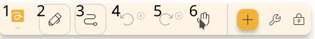

## Keyboard

Є кілька ярликів, які можна використати в редакторі.
Деякі з них пишуть під кнопками.

### Загальні налаштування

- `Ctrl` + `N`: новий файл
- `Ctrl` + `Shift` + `N`: новий файл з шаблону
- `Ctrl` + `E`: Експорт файлу
- Nightly (2.4): `Ctrl` + `Shift` + `E`: Export file (text based)
- `Ctrl` + `P`: Друкувати файл
- `Ctrl` + `Shift` + `E` (Nightly (2.4): `Ctrl` + `Alt` + `Shift` + `E`): Export file as image
- `Ctrl` + `Alt` + `E`: Експортувати файл як svg
- `Ctrl` + `Alt` + `Shift` + `E` (Nightly (2.4): `Ctrl` + `Shift` + `P`): Export file as pdf
- `Ctrl` + `Alt` + `P`: Відкриті пакети
- `Ctrl` + `Alt` + `S`: Відкрити налаштування

### Проект

- `Ctrl` + `K`: Open search
- `Ctrl` + `Z`: Відмінити
- `Ctrl` + `Y`: Повторити
- `Ctrl` + `Shift` + `P`: Відкривати вікно точок
- `Ctrl` + `B`: Відкрити фонове вікно
- `Ctrl` + `S`: Зберегти
- `Alt` + `S`: Змінити шлях
- `Ctrl` + (`1` - `0`): Перемкнутися на інструмент
- `Ctrl` + `+`: Збільшувати масштаб
- `Ctrl` + `-`: Збільшити

## Ручка

За замовчуванням, ручка налаштована для функції в такому випадку:

- `Пен`: налаштований як ручка.
- `Перший` (основна кнопка, якщо підтримується): Поміняйте на інструмент керування при натисканні кнопки вручну.
- `Second` (Secondary button, if supported): Change to second tool (see [configure](#configure) section below) while pressed.

## Configuring {#configure}

You can customize your controls by changing which tools your inputs map to.

**Note:** Input configurations will be ignored while certain tools are selected, such as the Lasso Select tool, the Rectangle Select tool, the Label tool, and the Area tool.

To begin, go to `Settings` → `Inputs` and then select the input method you want to configure, such as `Mouse`, `Touch`, or `Pen`. You will be presented with a list of configurable inputs and the tools they are currently mapped to.

After selecting an input, you will have 3 options:

- `Active Tool`: The input will act as the currently selected tool on the toolbar.
- `Hand Tool`: The input will temporarily switch to the hand tool, allowing you to move around the canvas.
- `Specific Tool on Toolbar`: The input will temporarily switch to a tool on your toolbar, based on the position number you specify. Positions are counted starting from the left, so if you specify position `1`, the first tool on the left will be selected. See the screenshot below for an example of how position numbers are counted. For information about how to reorder your tools, see [Customizing the Toolbar](../intro/#customizing-the-toolbar).

