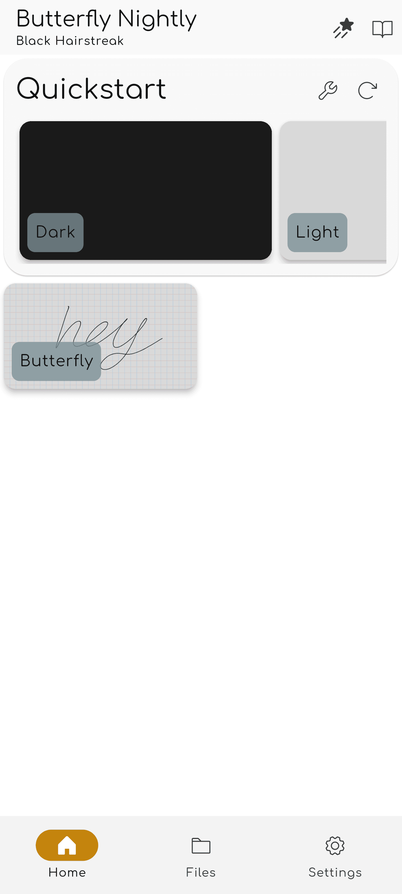
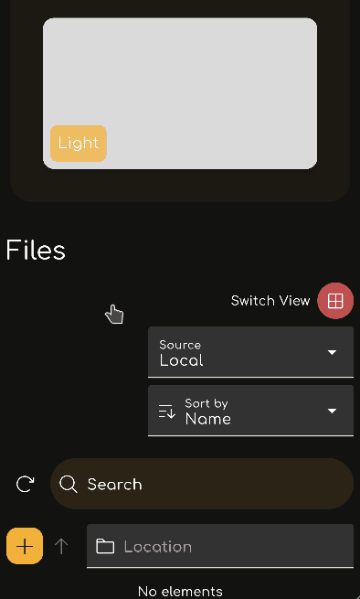
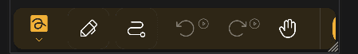

import {
  Gear,
  Plus,
  FloppyDisk,
  MagnifyingGlass,
  ScribbleLoop,
  Pen,
  Path,
  ArrowCounterClockwise,
  ArrowClockwise,
  Hand,
  Wrench,
  Lock,
  Folder,
  GridFour,
  List,
} from "@phosphor-icons/react";
import { Tabs, TabItem } from "@astrojs/starlight/components";
import logo from "/public/img/logo.svg";


---

> Welcome to Butterfly, the open-source note app.

Butterfly is a note-taking app that aims for a unified experience across all platforms. It provides a simple UI with powerful customization.

## Getting started

> You can use the sidebar to navigate quickly through this wiki.

To start working on the app, you have two options:

1. [Download](/downloads) the app version that is appropriate for your platform. Butterfly can run on most mobile, desktop, and web platforms.
2. Use the [web version](https://web.butterfly.linwood.dev) if you cannot find your platform or if you don't want to install the app. See [here](storage#web) for information about file storage on the web version.

> Once you open the app, continue reading.

## The Home View

<Tabs syncKey="platform">
  <TabItem label="Desktop">

```

The top of the screen holds the update banner, a link to this documentation, and the <Gear className="inline-icon"/> Settings button. Finally, to the right of the <Gear className="inline-icon"/> Settings button, you have a drop-down menu for controlling when the update banner will appear (always/never/on updates).

The Files section is the main area to the left. Here, you can do the following operations:
- Select the display type (<GridFour className="inline-icon"/> Grid or <List className="inline-icon"/> List)
- Select the [source storage](../storage) of the files
- Sort the display order of the files
- Add a folder, file, template, or import files by clicking the <Plus className="inline-icon"/> plus sign
- Switch to a different directory by typing in the <Folder className="inline-icon"/> Location field
- Search for files

Finally, to the right, you have the Quickstart display with the templates available in the current location. For a fresh install, this includes the Light and Dark templates.
```

</TabItem>
  <TabItem label="Mobile">

```
When opening Butterfly on a mobile device, you will be presented with a screen like this:

The top of the screen holds the update banner. Below it, you can find a link to this documentation, the <Gear className="inline-icon"/> Settings button, and a drop-down menu for controlling when the update banner will appear (always/never/on updates).

Below those, you can find the Quickstart section with the templates available in the current location. For a fresh install, this includes the Light and Dark templates.

Scrolling down, you will see the Files section:
\

Here, you can do the following operations:
- Select the display type (<GridFour className="inline-icon"/> Grid or <List className="inline-icon"/> List)
- Select the [source storage](../storage) of the files
- Sort the display order of the files
- Add a folder, file, template, or import files by clicking the <Plus className="inline-icon"/> plus sign
- Switch to a different directory by typing in the <Folder className="inline-icon"/> Location field
- Search for files
```

</TabItem>
</Tabs>

Once you open a document by selecting a template or an existing file, you will get to the **Document View**.

## The Document View


You can return from the document view to the document list with the back action of your device. As with the home view, the document display changes based on your device.

<Tabs syncKey="platform">
  <TabItem label="Desktop">

```
In the top-left of the screen, you have the file bar:\


This holds, from left to right:

- The  Butterfly button, which opens the menu.
- The Name field, which displays the name of the note. You can rename the note by typing a new name into the field and saving the note.
- The <FloppyDisk className="inline-icon"/> Save button. You can enable auto-saving and optionally disable this button by going to Settings → Behaviors → Autosave.
- The <MagnifyingGlass className="inline-icon"/> Search button, which allow you to search for elements within the note.
```

</TabItem>
  <TabItem label="Mobile">

```
At the top of the screen, you have the file bar:\


This holds, from left to right:

- The  Butterfly button, which opens the menu.
- The Name field, which displays the name of the note. You can rename the note by typing a new name into the field and saving the note.
- The <FloppyDisk className="inline-icon"/> Save button. You can enable auto-saving and optionally disable this button by going to Settings → Behaviors → Autosave.
- The <MagnifyingGlass className="inline-icon"/> Search button, which allow you to search for elements within the note.
```

</TabItem>
</Tabs>

### The Toolbar

<Tabs syncKey="platform">
  <TabItem label="Desktop">

```
In the top-right of the screen, you have the toolbar:\


By default, this bar has:

- The [<ScribbleLoop className="inline-icon"/> Lasso Select tool](tools/select)
- The [<Pen className="inline-icon"/> Pen tool](tools/pen)
- The [<Path className="inline-icon"/> Path Erase tool](tools/path_eraser)
- The [<ArrowCounterClockwise className="inline-icon"/> Undo](tools/undo) and [<ArrowClockwise className="inline-icon"/> Redo](tools/redo) buttons
- The [<Hand className="inline-icon"/> Hand tool](tools/hand).

Then you have the <Plus className="inline-icon"/> button to add elements to the tool bar, the <Wrench className="inline-icon"/> button to configure the document, and finally the <Lock className="inline-icon"/> tool to lock the zoom and/or the position of the screen. If some of the elements on the toolbar are not visible to you, click and drag (or swipe) left or right to reveal further tools.
```

</TabItem>
  <TabItem label="Mobile">

```
At the bottom of the screen, you have the toolbar:\


By default, this bar has:

- The [<ScribbleLoop className="inline-icon"/> Lasso Select tool](tools/select)
- The [<Pen className="inline-icon"/> Pen tool](tools/pen)
- The [<Path className="inline-icon"/> Path Erase tool](tools/path_eraser)
- The [<ArrowCounterClockwise className="inline-icon"/> Undo](tools/undo) and [<ArrowClockwise className="inline-icon"/> Redo](tools/redo) buttons
- The [<Hand className="inline-icon"/> Hand tool](tools/hand).

Then you have the <Plus className="inline-icon"/> button to add elements to the tool bar, the <Wrench className="inline-icon"/> button to configure the document, and finally the <Lock className="inline-icon"/> tool to look the zoom and/or the position of the screen. If some of the elements on the toolbar are not visible to you, swipe left or right to reveal further tools.
```

</TabItem>
</Tabs>

#### Customizing the Toolbar

<Tabs syncKey="platform">
  <TabItem label="Desktop">

```
To add more tools to the toolbar, click the <Plus className="inline-icon"/> Add button. In the Add menu, you can use the search bar or filters to find the tool you are looking for. For more information, see [Add](add).

To reorder the tools on your toolbar, first select a tool and then click-and-drag it to a new position. Some input methods have shortcuts to quickly switch to tools based on their position on the toolbar, which can be [configured](shortcuts#configure).

Many tools have a configuration menu, which allows you to change settings about how the tool behaves. To open this menu, first select a tool in the toolbar and then click it again.
```

</TabItem>
  <TabItem label="Mobile">
  
    To add more tools to the toolbar, tap the <Plus className="inline-icon"/> Add button. In the Add menu, you can use the search bar or filters to find the tool you are looking for. For more information, see [Add](add).

```
To reorder the tools on your toolbar, first select a tool and then long-tap and drag it to a new position. Some input methods have shortcuts to quickly switch to tools based on their position on the toolbar, which can be [configured](shortcuts#configure).

Many tools have a configuration menu, which allows you to change settings about how the tool behaves. To open this menu, first select a tool in the toolbar and then tap it again.
```

</TabItem>
</Tabs>
