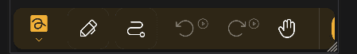

import { Gear,  Plus,  FloppyDisk,  MagnifyingGlass, ScribbleLoop, Pen, Path, ArrowCounterClockwise, ArrowClockwise, Hand, Wrench, Lock} from "@phosphor-icons/react";
import { Tabs, TabItem } from '@astrojs/starlight/components';
import logo from '/public/img/logo.svg';

---

> 欢迎使用 Butterfly，开源笔记应用。

Butterflight是一个注意事项，它旨在实现所有平台的统一体验。 它提供简单的用户界面强大的自定义功能。

## 入门开始

> 您可以使用侧边栏快速导航wiki。

要开始运行应用，您有两个选项：

1. [Downloads](/downloads) 适合您平台的应用程序版本(Butterfly可以在大多数移动端、桌面和网页平台上运行)。
2. 如果您找不到您的平台，或如果您不想将其安装在它上，请使用 [web version](https://web.butterfly.linwood.dev)。 See [here](storage#web) about file storage on the web version.

> 一旦您打开了应用程序，继续阅读。

## 主视图

主要观点由几个要素组成

<Tabs syncKey="platform">
    <TabItem label="Desktop">
        。 ng)
        屏幕顶部持有更新的横幅， 此文档链接和 <Gear className="inline-icon"/> 配置图标。 最后，对于 <Gear className="inline-icon"/> 配置符号的右边，您有一个下拉菜单来控制此横幅将显示的时间(始终显示/不显示/更新)。
        左边主要地区的“文件”部分。 在这里， 您可以做典型的操作：
        - 选择显示类型 (grid 或 list)
        - 选择 [源存储] (... 文件
        - 排序文件显示顺序
        - 添加一个文件夹， 文件, 模板 或者通过单击 <Plus className="inline-icon"/> 加签署
        导入文件 - 输入到所需位置的直接路径(位置字段)，
        - 搜索文件
        结束 向右倾斜； 您可以使用当前位置的模板快速开始显示。 对于一个新的安装，这包括光明和黑暗模板
    </TabItem>
    <TabItem label="Mobile">
        当在移动设备上打开Butterfight时，您将被展示为这个
        ！ 欢迎屏幕第一部分](欢迎屏幕屏幕移动版1)。 ng)
        屏幕顶部持有更新的横幅， 你可以在下面找到文档链接，旁边的 <Gear className="inline-icon"/> 配置图标。 最后，对于 <Gear className="inline-icon"/> 配置符号的右边，您有一个下拉菜单来控制此横幅将显示的时间(始终显示/不显示/更新)。
        在这些下，您可以找到快速起始部分，持有您可以携带的模板。 通过防守，模板是亮色和黑色的模板。
        向下滚动。 您将看到文件接口：
        \
        ！ 欢迎屏幕第二部分](Welcome_screen_mobile_2) ng)  
        左主要地区的“文件”部分。 在这里， 您可以做典型的操作：
        - 选择显示类型 (grid 或 list)
        - 选择 [源存储] (... 文件
        - 排序文件显示顺序
        - 添加一个文件夹， 文件, 模板 或者通过单击 <Plus className="inline-icon"/> 加签署
        导入文件 - 输入到所需位置的直接路径(位置字段)，
        - 搜索文件
 </TabItem>
</Tabs>

一旦通过选择模板或现有文件打开文档，您将获得**文档视图**

## 文档视图

您可以通过设备的后退操作从文档视图返回文档列表。 和主视图一样，文档显示基于您设备的更改。

<Tabs syncKey="platform">
    <TabItem label="Desktop">
  In the Desktop view, you'll have at the top left the file bar\
  \
  This holds, from left to right, the  butterfly button to open the menu. 接下来是显示便笺名称的名称字段。 您可以通过输入一个新名称重命名该字段，然后使用 <FloppyDisk className="inline-icon"/> 保存按钮将其保存。 最后，您可以在 <MagnifyingGlass className="inline-icon"/> 中搜索笔记中的元素。
  \
  At the top right of the screen you have the toolbar\
  \
  By default this bar has the <ScribbleLoop className="inline-icon"/> lasso tool; the <Pen className="inline-icon"/> pen tool; the <Path className="inline-icon"/> path erase tool; the <ArrowCounterClockwise className="inline-icon"/> undo and <ArrowClockwise className="inline-icon"/> redo butons, and the <Hand className="inline-icon"/> hand tool. 然后你有要添加元素到工具栏的 <Plus className="inline-icon"/> 按钮，配置文档的 <Wrench className="inline-icon"/> 按钮。 最后是 <Lock className="inline-icon"/> 工具来查看屏幕的缩放和/或位置。
  ### 重要笔记
  1。 如果工具栏上的某些元素对您不可见，单击并拖动(或滑动)左侧和右侧显示更多工具。
  2. 选择工具后，将出现一个小菜单。 再次长按工具可以将其拖动到一个新位置
  3。 您可以通过单击 <Plus className="inline-icon"/> 加号来添加更多工具到工具栏。
 </TabItem>
 <TabItem label="Mobile">
  In the mobile view, you'll have at the top the file bar\
     \
  This holds, from left to right, the  butterfly button to open the menu. 接下来是显示便笺名称的名称字段。 您可以通过输入一个新名称重命名该字段，然后使用 <FloppyDisk className="inline-icon"/> 保存按钮将其保存。 最后，您可以在 <MagnifyingGlass className="inline-icon"/> 中搜索笔记中的元素。
  \
  At the bottom of the screen you have the toolbar\
  \
  By default this bar has the <ScribbleLoop className="inline-icon"/> lasso tool; the <Pen className="inline-icon" /> pen tool; the <Path className="inline-icon"/> path erase tool; the <ArrowCounterClockwise className="inline-icon"/> undo and <ArrowClockwise className="inline-icon"/> redo butons, and the <Hand className="inline-icon"/> hand tool. 然后你有要添加元素到工具栏的 <Plus className="inline-icon"/> 按钮，配置文档的 <Wrench className="inline-icon"/> 按钮。 最后是 <Lock className="inline-icon"/> 工具来查看屏幕的缩放和/或位置。
  ### 重要笔记
  1。 如果工具栏上的某些元素对您不可见，或向左和向右滑动以显示更多元素。
  2. 在选择工具后，一个小菜单将会进行配置。 再次长按工具可以将其拖动到一个新位置
  3。 您可以通过单击 <Plus className="inline-icon"/> 加号来添加更多工具到工具栏。
 </TabItem>
</Tabs>
