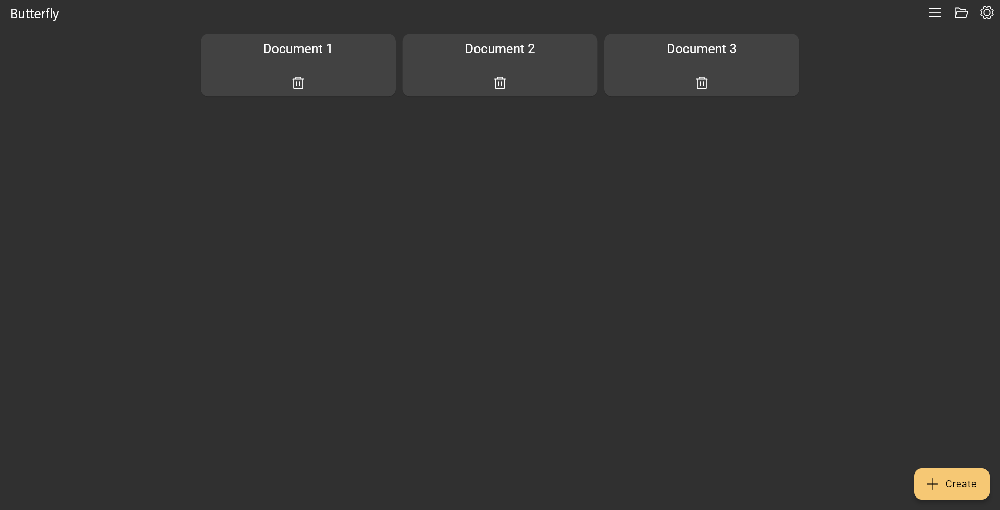

# Introduction

---

> Welcome to Butterfly, the opensource note app.
> Use the sidebar to navigate through the wiki.

## Getting started

Visit [the downloads](/downloads) to download the app for your platform.
Use [web version](https://butterfly.linwood.dev) if you cannot find your platform.

Then you can open the app. On the screen you can see all documents you can edit. On the first start it should be empty.
To open a file, use the open button in the right corner. The settings button is also there.
Create a document by clicking on the bottom right plus icon. Give the document a name.
Click oo the document to open it.

## Main view

With the top left button you can go back to the document list. The document name will be displayed on the right of it. Undo, redo and project settings are in the top right corner.

Below it, you can find the toolbar. Left, you can switch between view and edit mode. Right to it, there you find the zoom options. In the top right corner there are the tool options.

- The view toolbar options are background, export and save.
- The edit toolbar options are the painters. You can find [here](background/intro) more.
